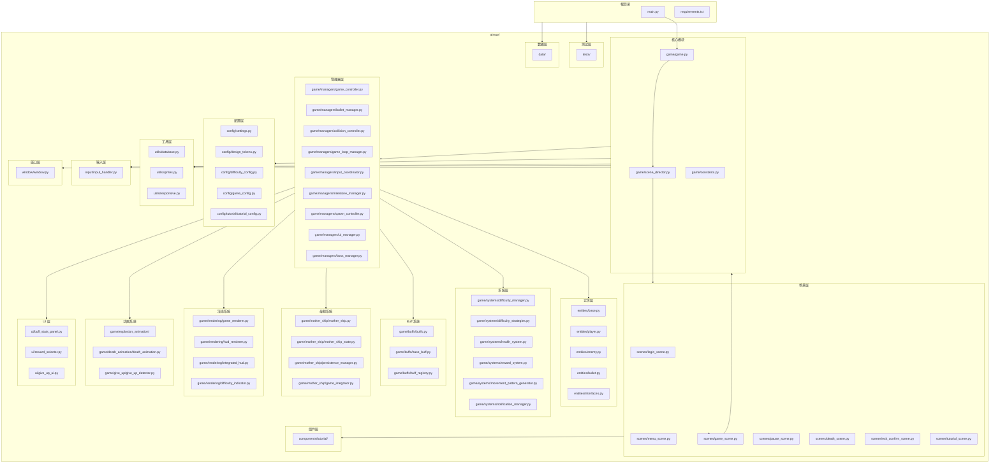

# Air War (飞机大战)

一款使用 Python 和 Pygame 开发的 2D 太空射击游戏。

## 快速开始

### 环境要求

- Python 3.x
- pygame >= 2.6.1
- pillow >= 12.2.0

### 安装依赖

```bash
pip install -r requirements.txt
```

### 运行游戏

```bash
python main.py
```

## 游戏玩法

### 目标

驾驶太空战机，击败敌人和 Boss，获取高分。

### 游戏特色

- 三种难度模式：简单、普通、困难
- 动态难度系统：根据 Boss 击杀数自动调整难度
- 18 种 Buff 系统：击杀敌人获得奖励，可选择不同强化
- MotherShip 存档：靠近母舰可保存游戏进度
- 多种敌人类型：直线、正弦、锯齿、俯冲、悬停、螺旋

### 控制说明

#### 游戏内操作

| 按键 | 功能 |
|------|------|
| 方向键 / WASD | 移动战机 |
| 空格键 | 射击 |
| ESC | 暂停游戏 |
| L | 切换 HUD 显示 |
| H (长按) | 停靠母舰 |
| K (长按3秒) | 投降 |

#### 菜单操作

| 按键 | 功能 |
|------|------|
| 方向键 / WASD | 选择菜单项 |
| 回车键 / 空格键 | 确认选择 |
| ESC | 返回/取消 |

#### 登录界面

| 按键 | 功能 |
|------|------|
| TAB | 切换登录/注册模式 |
| 退格键 | 删除输入 |
| 回车键 | 确认 |
| ESC | 取消 |

#### 教程操作

| 按键 | 功能 |
|------|------|
| 左右方向键 | 导航教程 |
| 回车键 / 空格键 | 确认/下一步 |
| ESC | 退出教程 |

## 项目结构



## 目录说明

```
airwar/
├── components/           # UI 组件
│   └── tutorial/        # 教程组件（导航面板、渲染器）
├── config/              # 游戏配置
│   ├── settings.py      # 主配置
│   ├── design_tokens.py # 设计令牌
│   ├── difficulty_config.py  # 难度配置
│   ├── game_config.py   # 游戏配置
│   └── tutorial/        # 教程配置
├── data/                # 数据存储
│   ├── users.json       # 用户数据
│   └── user_docking_save.json  # 存档数据
├── entities/            # 游戏实体
│   ├── base.py          # 实体基类
│   ├── player.py        # 玩家战机
│   ├── enemy.py         # 敌人
│   ├── bullet.py        # 子弹
│   └── interfaces.py    # 实体接口
├── game/                # 核心游戏逻辑
│   ├── managers/        # 各类管理器
│   │   ├── game_controller.py    # 游戏控制器
│   │   ├── game_loop_manager.py  # 游戏循环管理
│   │   ├── bullet_manager.py     # 子弹管理
│   │   ├── collision_controller.py  # 碰撞检测
│   │   ├── input_coordinator.py  # 输入协调
│   │   ├── spawn_controller.py   # 生成控制
│   │   ├── ui_manager.py          # UI 管理
│   │   ├── boss_manager.py        # Boss 管理
│   │   └── milestone_manager.py   # 里程碑管理
│   ├── systems/         # 游戏系统
│   │   ├── difficulty_manager.py  # 难度系统
│   │   ├── difficulty_strategies.py  # 难度策略
│   │   ├── health_system.py       # 生命值系统
│   │   ├── reward_system.py       # 奖励系统
│   │   └── movement_pattern_generator.py  # 移动模式生成
│   ├── buffs/           # Buff 系统
│   │   ├── buffs.py     # Buff 定义
│   │   ├── base_buff.py # Buff 基类
│   │   └── buff_registry.py  # Buff 注册表
│   ├── mother_ship/     # 母舰系统
│   │   ├── mother_ship.py      # 母舰实体
│   │   ├── mother_ship_state.py  # 母舰状态机
│   │   ├── persistence_manager.py  # 存档管理
│   │   ├── event_bus.py        # 事件总线
│   │   ├── input_detector.py   # 输入检测
│   │   └── progress_bar_ui.py  # 进度条 UI
│   ├── rendering/       # 渲染系统
│   │   ├── game_renderer.py      # 游戏渲染器
│   │   ├── hud_renderer.py       # HUD 渲染器
│   │   ├── integrated_hud.py     # 集成 HUD
│   │   └── difficulty_indicator.py  # 难度指示器
│   ├── explosion_animation/  # 爆炸动画
│   ├── death_animation/       # 死亡动画
│   ├── give_up/               # 投降系统
│   ├── controllers/           # 控制器
│   ├── spawners/              # 生成器
│   ├── constants.py           # 游戏常量
│   ├── game.py                # 游戏主类
│   └── scene_director.py      # 场景导演
├── input/               # 输入处理
│   └── input_handler.py # 输入处理器
├── scenes/              # 场景管理
│   ├── scene.py         # 场景基类
│   ├── login_scene.py   # 登录场景
│   ├── menu_scene.py    # 菜单场景
│   ├── game_scene.py    # 游戏场景
│   ├── pause_scene.py   # 暂停场景
│   ├── death_scene.py   # 死亡场景
│   ├── exit_confirm_scene.py  # 退出确认场景
│   └── tutorial_scene.py      # 教程场景
├── tests/               # 测试套件
│   ├── test_game_*.py   # 游戏逻辑测试
│   ├── test_scenes.py   # 场景测试
│   ├── test_buffs.py    # Buff 系统测试
│   ├── test_mother_ship.py  # 母舰系统测试
│   └── ...              # 其他测试模块
├── ui/                  # UI 组件
│   ├── buff_stats_panel.py      # Buff 属性面板
│   ├── reward_selector.py        # 奖励选择器
│   ├── difficulty_coefficient_panel.py  # 难度系数面板
│   ├── give_up_ui.py             # 投降 UI
│   ├── game_over_screen.py       # 游戏结束画面
│   ├── effects.py                # 特效
│   └── particles.py              # 粒子效果
├── utils/               # 工具函数
│   ├── database.py      # 数据库工具
│   ├── sprites.py       # 精灵工具
│   └── responsive.py    # 响应式布局
└── window/              # 窗口管理
    └── window.py        # 窗口类
```

## 技术栈

- **游戏框架**: Pygame
- **图像处理**: Pillow
- **架构模式**: Scene Pattern, Manager Pattern, Observer Pattern, State Machine Pattern
- **测试框架**: pytest
