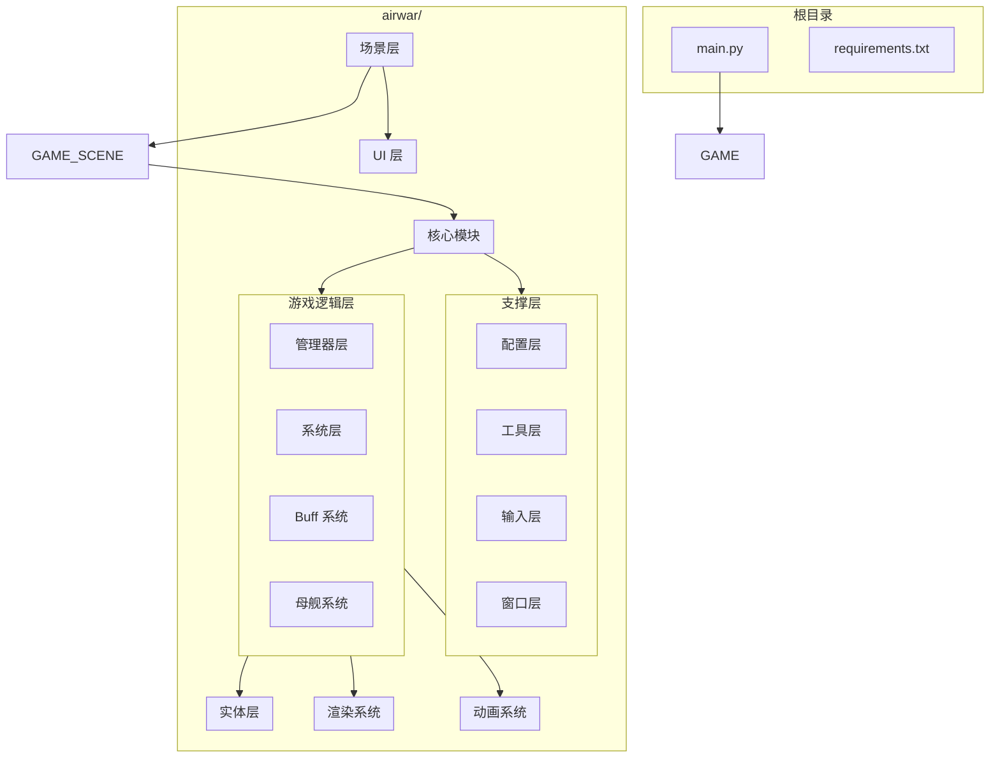

# Air War (飞机大战)

一款使用 Python 和 Pygame 开发的 2D 太空射击游戏。

## 快速开始

### 环境要求

- Python 3.x
- pygame >= 2.6.1
- pillow >= 12.2.0

### 安装依赖

```bash
pip install -r requirements.txt
```

### 运行游戏

```bash
python main.py
```

## 游戏玩法

### 目标

驾驶太空战机，击败敌人和 Boss，获取高分。

### 游戏特色

- 三种难度模式：简单、普通、困难
- 动态难度系统：根据 Boss 击杀数自动调整难度
- 18 种 Buff 系统：击杀敌人获得奖励，可选择不同强化
- MotherShip 存档：靠近母舰可保存游戏进度
- 多种敌人类型：直线、正弦、锯齿、俯冲、悬停、螺旋

## 控制说明

### 游戏内操作

| 按键 | 功能 |
|------|------|
| 方向键 / WASD | 移动战机 |
| 空格键 | 射击 |
| ESC | 暂停游戏 |
| L | 切换 HUD 显示 |
| H (长按) | 停靠母舰 |
| K (长按3秒) | 投降 |

### 菜单操作

| 按键 | 功能 |
|------|------|
| 方向键 / WASD | 选择菜单项 |
| 回车键 / 空格键 | 确认选择 |
| ESC | 返回/取消 |

### 登录界面

| 按键 | 功能 |
|------|------|
| TAB | 切换登录/注册模式 |
| 退格键 | 删除输入 |
| 回车键 | 确认 |
| ESC | 取消 |

### 教程操作

| 按键 | 功能 |
|------|------|
| 左右方向键 | 导航教程 |
| 回车键 / 空格键 | 确认/下一步 |
| ESC | 退出教程 |

## 项目结构



## 目录说明

```
airwar/
├── components/          # UI 组件
│   └── tutorial/       # 教程组件
├── config/             # 游戏配置
│   ├── settings.py     # 主配置
│   ├── design_tokens.py
│   ├── difficulty_config.py
│   ├── game_config.py
│   └── tutorial/
├── data/               # 数据存储
│   ├── users.json      # 用户数据
│   └── user_docking_save.json
├── entities/           # 游戏实体
│   ├── base.py         # 实体基类
│   ├── player.py       # 玩家战机
│   ├── enemy.py        # 敌人
│   ├── bullet.py       # 子弹
│   └── interfaces.py
├── game/               # 核心游戏逻辑
│   ├── managers/       # 管理器模块
│   │   ├── game_controller.py
│   │   ├── game_loop_manager.py
│   │   ├── bullet_manager.py
│   │   ├── collision_controller.py
│   │   ├── input_coordinator.py
│   │   ├── spawn_controller.py
│   │   ├── ui_manager.py
│   │   ├── boss_manager.py
│   │   └── milestone_manager.py
│   ├── systems/        # 游戏系统
│   │   ├── difficulty_manager.py
│   │   ├── difficulty_strategies.py
│   │   ├── health_system.py
│   │   ├── reward_system.py
│   │   └── movement_pattern_generator.py
│   ├── buffs/          # Buff 系统
│   │   ├── buffs.py
│   │   ├── base_buff.py
│   │   └── buff_registry.py
│   ├── mother_ship/    # 母舰系统
│   │   ├── mother_ship.py
│   │   ├── mother_ship_state.py
│   │   ├── persistence_manager.py
│   │   ├── event_bus.py
│   │   ├── input_detector.py
│   │   └── progress_bar_ui.py
│   ├── rendering/      # 渲染系统
│   │   ├── game_renderer.py
│   │   ├── hud_renderer.py
│   │   ├── integrated_hud.py
│   │   └── difficulty_indicator.py
│   ├── explosion_animation/
│   ├── death_animation/
│   ├── give_up/
│   ├── controllers/
│   ├── spawners/
│   ├── constants.py
│   ├── game.py
│   └── scene_director.py
├── input/              # 输入处理
│   └── input_handler.py
├── scenes/             # 场景管理
│   ├── scene.py
│   ├── login_scene.py
│   ├── menu_scene.py
│   ├── game_scene.py
│   ├── pause_scene.py
│   ├── death_scene.py
│   ├── exit_confirm_scene.py
│   └── tutorial_scene.py
├── tests/              # 测试套件
│   ├── test_game_*.py
│   ├── test_scenes.py
│   ├── test_buffs.py
│   ├── test_mother_ship.py
│   └── ...
├── ui/                 # UI 组件
│   ├── buff_stats_panel.py
│   ├── reward_selector.py
│   ├── difficulty_coefficient_panel.py
│   ├── give_up_ui.py
│   ├── game_over_screen.py
│   ├── effects.py
│   └── particles.py
├── utils/              # 工具函数
│   ├── database.py
│   ├── sprites.py
│   └── responsive.py
└── window/             # 窗口管理
    └── window.py
```

## 技术栈

- **游戏框架**: Pygame
- **图像处理**: Pillow
- **架构模式**: Scene Pattern, Manager Pattern, Observer Pattern, State Machine Pattern
- **测试框架**: pytest
