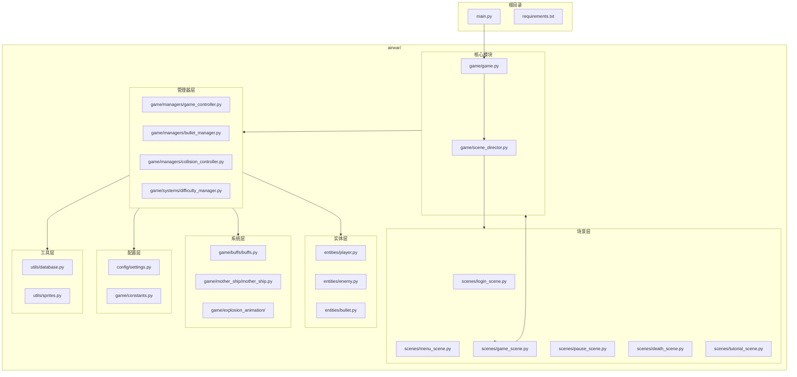

# Air War (飞机大战)

一款使用Python和Pygame开发的2D太空射击游戏。

## 快速开始

### 环境要求

- Python 3.x
- pygame >= 2.6.1
- pillow >= 12.2.0

### 安装依赖

```bash
pip install -r requirements.txt
```

### 运行游戏

```bash
python main.py
```

## 游戏玩法

### 目标
驾驶太空战机，击败敌人和Boss，获取高分。

### 游戏特色

- 三种难度模式：简单、普通、困难
- 动态难度系统：根据Boss击杀数自动调整难度
- 18种Buff系统：击杀敌人获得奖励，可选择不同强化
- MotherShip存档：靠近母舰可保存游戏进度
- 多种敌人类型：直线、正弦、锯齿、俯冲、悬停、螺旋

### 控制说明

#### 游戏内操作

| 按键 | 功能 |
|------|------|
| 方向键 / WASD | 移动战机 |
| 空格键 | 射击 |
| ESC | 暂停游戏 |
| L | 切换HUD显示 |
| H (长按) | 停靠母舰（需靠近母舰） |
| K (长按3秒) | 投降（需靠近母舰） |

#### 菜单操作

| 按键 | 功能 |
|------|------|
| 方向键 / WASD | 选择菜单项 |
| 回车键 / 空格键 | 确认选择 |
| ESC | 返回/取消 |

#### 登录界面

| 按键 | 功能 |
|------|------|
| TAB | 切换登录/注册模式 |
| 退格键 | 删除输入 |
| 回车键 | 确认 |
| ESC | 取消 |

#### 教程操作

| 按键 | 功能 |
|------|------|
| 左右方向键 | 导航教程 |
| 回车键 / 空格键 | 确认/下一步 |
| ESC | 退出教程 |

## 项目结构



## 目录说明

```
airwar/
├── config/          # 游戏配置和常量
├── entities/        # 游戏实体（玩家、敌人、子弹）
├── game/            # 核心游戏逻辑
│   ├── managers/    # 各类管理器
│   ├── systems/     # 游戏系统（难度、奖励等）
│   ├── buffs/       # Buff系统
│   ├── mother_ship/ # 母舰系统
│   └── explosion_animation/  # 爆炸动画
├── scenes/          # 场景管理
├── ui/              # UI组件
├── utils/           # 工具函数
└── window/          # 窗口管理
```

## 技术栈

- **游戏框架**: Pygame
- **图像处理**: Pillow
- **架构模式**: Scene Pattern, Manager Pattern, Observer Pattern
