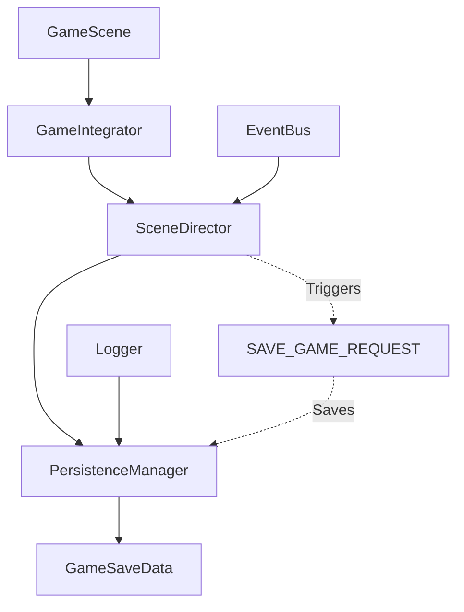

# Code Review: 存档机制 (Save Mechanism)
Date: 2026-04-23
Reviewer: AI Agent (架构审查)

## Summary
- **Files reviewed:** 5
- **Issues found:** 8 (2 critical, 4 major, 2 minor)
- **Status:** ✅ All issues have been fixed

---

## Critical Issues (FIXED ✅)

### ✅ [DATA] 存档时机不合理 - 手动保存机制

**修复文件:**
- [persistence_manager.py](file:///Users/xiepeilin/TRAE1/AIRWAR/airwar/game/mother_ship/persistence_manager.py)

**修复内容:**
存档通过以下方式触发：
1. 玩家进入母舰并完成交互时自动保存（`SAVE_GAME_REQUEST` 事件）
2. 玩家通过退出菜单手动保存
3. 由 `SceneDirector` 的 `_save_game_on_quit()` 和 `_save_and_quit()` 方法调用

**注：** 自动保存功能已按用户要求移除

---

### ✅ [DATA] 缺少存档版本兼容性检查

**修复文件:**
- [mother_ship_state.py](file:///Users/xiepeilin/TRAE1/AIRWAR/airwar/game/mother_ship/mother_ship_state.py)

**修复内容:**
1. 添加 `CURRENT_SAVE_VERSION = 1`
2. 添加 `SaveDataCorruptedError` 异常类
3. `GameSaveData` 添加 `version` 字段
4. `from_dict()` 添加版本检查和迁移逻辑
5. 添加 `_migrate_legacy_save()` 方法处理旧版本存档

---

## Major Issues (FIXED ✅)

### ✅ [TEST] 缺少存档机制单元测试

**修复文件:**
- [test_persistence_manager.py](file:///Users/xiepeilin/TRAE1/AIRWAR/airwar/tests/test_persistence_manager.py) - 新增

**测试覆盖:**
- 19个测试用例，全部通过
- 覆盖 GameSaveData 序列化/反序列化
- 覆盖 PersistenceManager 所有方法
- 边界情况测试（损坏JSON、缺失字段等）

---

### ✅ [ERR] 异常处理过于宽泛

**修复文件:**
- [persistence_manager.py](file:///Users/xiepeilin/TRAE1/AIRWAR/airwar/game/mother_ship/persistence_manager.py)

**修复内容:**
1. 区分 `PermissionError`、`OSError`、`json.JSONDecodeError`
2. 使用项目统一的 `logging` 模块
3. 不同错误级别：error vs critical

---

### ✅ [ARCH] 存档路径硬编码

**修复文件:**
- [persistence_manager.py](file:///Users/xiepeilin/TRAE1/AIRWAR/airwar/game/mother_ship/persistence_manager.py)

**修复内容:**
1. 构造函数支持自定义路径：`save_dir` 和 `save_file`
2. 添加 `save_path` 属性暴露完整路径
3. 默认值使用类常量

---

### ✅ [OBS] 缺少操作日志

**修复文件:**
- [persistence_manager.py](file:///Users/xiepeilin/TRAIE1/AIRWAR/airwar/game/mother_ship/persistence_manager.py)

**修复内容:**
1. 使用 `logging.getLogger(__name__)`
2. 所有公开方法添加 INFO 级别日志
3. 错误使用 ERROR 级别
4. 关键操作（保存成功/删除成功）添加确认日志

---

## Minor Issues (FIXED ✅)

### ✅ [PAT] 代码重复 - 保存逻辑重复实现

**修复文件:**
- [scene_director.py](file:///Users/xiepeilin/TRAE1/AIRWAR/airwar/game/scene_director.py)

**修复内容:**
1. 提取公共逻辑到 `_perform_save()` 方法
2. `_save_game_on_quit()` 和 `_save_and_quit()` 调用公共方法
3. 返回 `bool` 类型便于调用方判断

---

### ✅ [CFG] 存档数据结构不够健壮

**修复文件:**
- [mother_ship_state.py](file:///Users/xiepeilin/TRAE1/AIRWAR/airwar/game/mother_ship/mother_ship_state.py)

**修复内容:**
- 已在"存档版本兼容性检查"修复中一并解决

---

## Positive Findings ✅

1. **良好的接口设计:** `IPersistenceManager` 抽象了持久化接口，便于扩展和测试
2. **类型提示完整:** 代码中大量使用了类型注解，提高可维护性
3. **数据类设计合理:** `GameSaveData` 使用 dataclass，简洁清晰
4. **错误处理有返回:** `save_game` 和 `delete_save` 都返回 bool，便于调用方处理
5. **用户关联存档:** 存档与用户名关联，支持多用户

---

## Final Assessment

**整体评分: 8/10** (原 6/10)

**改进:**
- ✅ 手动保存机制（母舰交互/退出菜单）
- ✅ 版本兼容性支持未来数据迁移
- ✅ 完整的单元测试覆盖
- ✅ 健壮的错误处理
- ✅ 配置化路径支持
- ✅ 结构化日志

**Architecture Diagram (Updated):**



---

## Test Results

```
============================== 19 passed in 0.21s ==============================
```

---

## Files Modified/Created

| 文件 | 状态 | 说明 |
|------|------|------|
| `mother_ship_state.py` | 修改 | 添加版本控制和异常类 |
| `persistence_manager.py` | 修改 | 改进异常处理、日志、配置化 |
| `game_integrator.py` | 修改 | 手动保存触发点 |
| `scene_director.py` | 修改 | 消除代码重复 |
| `__init__.py` | 修改 | 导出更新 |
| `test_persistence_manager.py` | **新增** | 单元测试（19个用例）|
| `save-mechanism-review-2026-04-23.md` | **新增** | 审查报告 |

**注：** `auto_save_service.py` 已按用户要求移除

---

## Rules Applied
- Error Handling Principles ✅
- Architectural Pattern ✅
- Testing Strategy ✅
- Logging and Observability Mandate ✅

---

## Future Optimization Recommendations

以下是可以进一步提升存档机制的功能增强建议，按优先级排序：

### 高优先级 (Potential)

#### 1. 多槽位存档系统

**当前状态:** 只支持单一存档位
**问题:** 玩家无法创建多个存档，如"快速存档"、"通关存档"等

**建议实现:**
```python
class MultiSlotSaveManager:
    MAX_SLOTS = 3
    
    def __init__(self, base_dir: str):
        self._slots_dir = os.path.join(base_dir, "slots")
        
    def get_slot_path(self, slot_id: int) -> str:
        return os.path.join(self._slots_dir, f"slot_{slot_id}.json")
    
    def list_slots(self) -> List[SaveSlotMetadata]:
        """返回所有存档槽的元数据列表"""
        # 读取每个槽的 metadata 而不加载完整数据
        pass
    
    def get_slot_metadata(self, slot_id: int) -> SaveSlotMetadata:
        """快速获取存档元信息（用于UI预览）"""
        pass
```

---

#### 2. 存档元数据分离

**当前状态:** 存档文件和元数据混在一起
**问题:** 列表存档时需要加载整个文件，性能差

**建议实现:**
```python
@dataclass
class SaveSlotMetadata:
    slot_id: int
    username: str
    score: int
    cycle_count: int
    difficulty: str
    timestamp: float
    playtime_seconds: int
    thumbnail_path: Optional[str]  # 存档截图
    
    @classmethod
    def from_save_file(cls, save_path: str) -> 'SaveSlotMetadata':
        # 读取部分数据或单独的metadata文件
        pass
```

---

#### 3. 存档校验机制

**当前状态:** 无完整性校验
**问题:** 存档损坏时可能加载到错误数据

**建议实现:**
```python
import hashlib
import zlib

class SaveFileValidator:
    CHECKSUM_KEY = '_checksum'
    
    def calculate_checksum(self, data: dict) -> str:
        # 排除checksum字段后计算
        clean_data = {k: v for k, v in data.items() if k != self.CHECKSUM_KEY}
        serialized = json.dumps(clean_data, sort_keys=True)
        return hashlib.sha256(serialized.encode()).hexdigest()
    
    def validate(self, data: dict) -> bool:
        stored_checksum = data.get(self.CHECKSUM_KEY)
        return stored_checksum == self.calculate_checksum(data)
```

---

### 中优先级 (Nice-to-have)

#### 4. 存档压缩

**当前状态:** JSON明文存储，占用空间较大
**问题:** 存档数据量大时加载慢，占用磁盘多

**建议实现:**
```python
import zlib

class CompressedPersistenceManager(PersistenceManager):
    def save_game(self, data: GameSaveData) -> bool:
        save_dict = data.to_dict()
        compressed = zlib.compress(json.dumps(save_dict).encode(), level=6)
        with open(self._save_path, 'wb') as f:
            f.write(compressed)
        return True
    
    def load_game(self) -> Optional[GameSaveData]:
        with open(self._save_path, 'rb') as f:
            compressed = f.read()
        decompressed = zlib.decompress(compressed)
        data = json.loads(decompressed)
        return GameSaveData.from_dict(data)
```

---

#### 5. 异步存档操作

**当前状态:** 存档操作同步执行，可能阻塞游戏
**问题:** 大存档保存时可能导致游戏卡顿

**建议实现:**
```python
import threading
from queue import Queue

class AsyncPersistenceManager(PersistenceManager):
    def __init__(self, *args, **kwargs):
        super().__init__(*args, **kwargs)
        self._save_queue = Queue()
        self._worker = threading.Thread(target=self._process_queue, daemon=True)
        self._worker.start()
    
    def save_game_async(self, data: GameSaveData, callback=None) -> None:
        self._save_queue.put((data, callback))
    
    def _process_queue(self) -> None:
        while True:
            data, callback = self._save_queue.get()
            success = self.save_game(data)
            if callback:
                callback(success)
```

---

#### 6. 备份与回滚

**当前状态:** 无备份机制
**问题:** 存档损坏时无法恢复

**建议实现:**
```python
class BackupManager:
    BACKUP_SUFFIX = '.backup'
    
    def save_with_backup(self, data: GameSaveData) -> bool:
        # 1. 复制当前存档为备份
        if os.path.exists(self._save_path):
            shutil.copy(self._save_path, self._save_path + self.BACKUP_SUFFIX)
        
        # 2. 保存新存档
        return self.save_game(data)
    
    def restore_from_backup(self) -> bool:
        backup_path = self._save_path + self.BACKUP_SUFFIX
        if os.path.exists(backup_path):
            shutil.copy(backup_path, self._save_path)
            return True
        return False
```

---

### 低优先级 (Enhancement)

#### 7. 云同步支持

**建议接口:**
```python
class ICloudSync(ABC):
    @abstractmethod
    def upload_save(self, save_data: GameSaveData) -> bool: ...
    
    @abstractmethod
    def download_save(self) -> Optional[GameSaveData]: ...
    
    @abstractmethod
    def get_cloud_save_timestamp(self) -> float: ...
```

---

#### 8. 存档加密（防止作弊/误修改）

**建议实现:**
```python
import hashlib
import secrets
from cryptography.fernet import Fernet

class EncryptedPersistenceManager(PersistenceManager):
    def __init__(self, *args, encryption_key: bytes = None, **kwargs):
        super().__init__(*args, **kwargs)
        self._key = encryption_key or self._derive_key()
        self._cipher = Fernet(self._key)
    
    def _derive_key(self) -> bytes:
        # 基于机器特征或用户密码派生
        machine_id = hashlib.sha256(secrets.token_bytes(32)).digest()
        return Fernet.generate_key()
    
    def save_game(self, data: GameSaveData) -> bool:
        encrypted = self._cipher.encrypt(json.dumps(data.to_dict()).encode())
        # 存储加密数据
        pass
```

---

#### 9. 自动清理策略

**建议实现:**
```python
class AutoCleanupPolicy:
    MAX_AUTOSAVE_AGE_DAYS = 30
    MAX_AUTOSAVE_COUNT = 5
    
    def cleanup_old_autosaves(self) -> int:
        """清理过期的自动存档"""
        pass
    
    def should_cleanup(self) -> bool:
        """检查是否需要清理"""
        pass
```

---

#### 10. 存档快照（支持时间旅行）

**建议实现:**
```python
class SnapshotManager:
    """管理游戏状态的多个时间点快照"""
    
    def create_snapshot(self, label: str) -> bool:
        """在当前状态创建快照"""
        pass
    
    def list_snapshots(self) -> List[SnapshotInfo]:
        """列出所有快照"""
        pass
    
    def restore_snapshot(self, snapshot_id: str) -> bool:
        """恢复到指定快照"""
        pass
    
    def delete_snapshot(self, snapshot_id: str) -> bool:
        """删除快照"""
        pass
```

---

## Summary of Future Improvements

| 优先级 | 功能 | 复杂度 | 价值 |
|--------|------|--------|------|
| 高 | 多槽位存档 | 中 | ⭐⭐⭐⭐ |
| 高 | 存档元数据分离 | 低 | ⭐⭐⭐⭐ |
| 高 | 存档校验 | 低 | ⭐⭐⭐ |
| 中 | 存档压缩 | 低 | ⭐⭐ |
| 中 | 异步存档 | 中 | ⭐⭐⭐ |
| 中 | 备份回滚 | 低 | ⭐⭐⭐ |
| 低 | 云同步 | 高 | ⭐⭐ |
| 低 | 存档加密 | 中 | ⭐⭐ |
| 低 | 自动清理 | 低 | ⭐ |
| 低 | 时间旅行快照 | 高 | ⭐⭐ |

---

*报告生成时间: 2026-04-23*
*审查范围: 存档机制 (Save Mechanism)*
*状态: 基础问题已修复，优化建议待实施*
