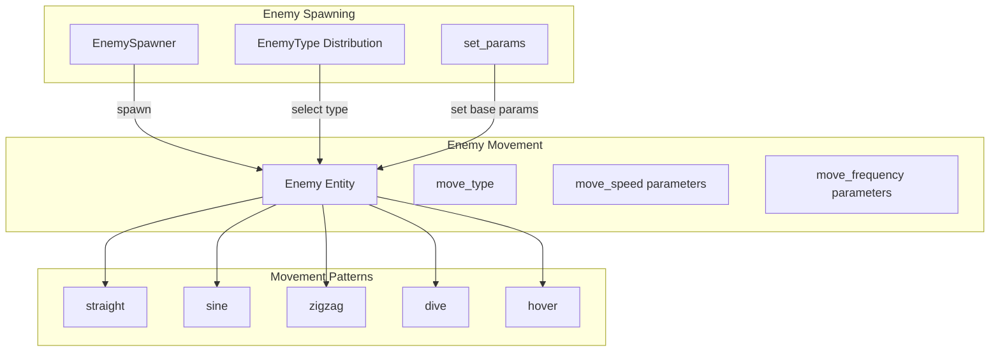
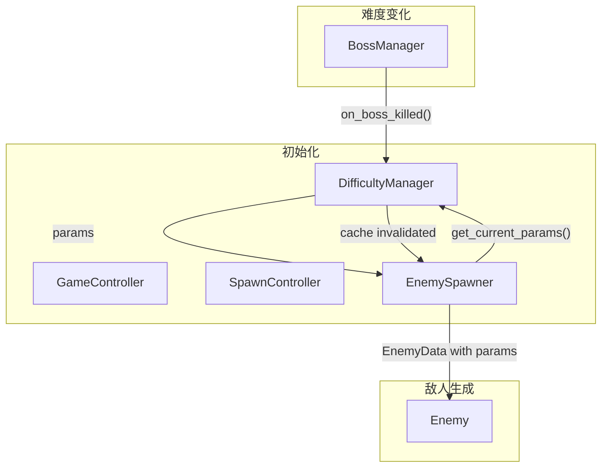

# 敌人移动轨迹与难度系统兼容性分析

> **分析日期：** 2026-04-22
> **分析目标：** 新难度系统与现有敌人移动轨迹代码的兼容性
> **状态：** 兼容性分析报告

---

## 1. 现有系统概述

### 1.1 敌人移动轨迹系统架构



### 1.2 现有代码关键属性

#### Enemy 类
| 属性 | 类型 | 来源 | 用途 |
|------|------|------|------|
| `move_type` | str | `_init_movement()` | 移动模式标识 |
| `data.speed` | float | EnemyData | 基础移动速度 |
| `data.fire_rate` | int | EnemyData | 射击间隔 |
| `move_amplitude` | float | sine 模式 | 正弦振幅 |
| `move_frequency` | float | sine 模式 | 正弦频率 |
| `zigzag_speed` | float | zigzag 模式 | 横向移动速度 |
| `zigzag_interval` | int | zigzag 模式 | 换向间隔 |
| `hover_speed` | float | hover 模式 | 悬停速度 |
| `hover_amplitude` | float | hover 模式 | 悬停振幅 |

#### EnemySpawner 类
| 属性 | 类型 | 来源 | 用途 |
|------|------|------|------|
| `speed` | float | `set_params()` | 敌人生成速度 |
| `spawn_rate` | int | `set_params()` | 生成间隔 |
| `health` | int | `set_params()` | 敌人生成血量 |
| `_enemy_type_distribution` | dict | 硬编码 | 敌人类型分布 |

#### Boss 类
| 属性 | 类型 | 来源 | 用途 |
|------|------|------|------|
| `data.speed` | float | BossData | Boss 移动速度 |
| `data.fire_rate` | int | BossData | Boss 射击间隔 |
| `phase` | int | 自动更新 | Boss 阶段 |

---

## 2. 新难度系统设计要点

### 2.1 DifficultyManager 核心功能

```python
class DifficultyManager:
    def get_current_params(self) -> dict:
        return {
            'speed': 基础速度 * speed_multiplier,
            'fire_rate': 基础射速 / fire_rate_multiplier,
            'aggression': 基础攻击欲望 * aggression_multiplier,
            'spawn_rate': 基础生成间隔 / spawn_multiplier,
            'complexity': 移动复杂度 (1-5),
        }
```

### 2.2 移动轨迹生成器

```python
class MovementPatternGenerator:
    PATTERNS = {
        1: ['straight'],
        2: ['straight', 'sine'],
        3: ['straight', 'sine', 'zigzag'],
        4: ['straight', 'sine', 'zigzag', 'hover'],
        5: ['straight', 'sine', 'zigzag', 'hover', 'spiral'],
    }
```

---

## 3. 潜在冲突分析

### 3.1 变量命名冲突

| 现有变量 | 新系统变量 | 冲突等级 | 说明 |
|---------|-----------|---------|------|
| `Enemy.move_type` | `MovementPatternGenerator.get_pattern()` | 🟢 低 | 功能不同，不直接冲突 |
| `Enemy.data.speed` | `DifficultyManager.get_speed_multiplier()` | 🟡 中 | 需要在计算时合并 |
| `Enemy.fire_timer` | `DifficultyManager.get_fire_rate_multiplier()` | 🟡 中 | 需要修改射击逻辑 |
| `zigzag_speed` | 难度增强参数 | 🟢 低 | 同名但作用域不同 |
| `move_amplitude` | 难度增强参数 | 🟢 低 | 同名但作用域不同 |

**冲突详情：**

```python
# 现有代码 (enemy.py:94-99)
def update(self, *args, **kwargs) -> None:
    base_speed = self.data.speed  # 现有基础速度

    if self.move_type == "sine":
        self.move_timer += 1
        self.rect.y += base_speed
        self.rect.x = self.start_x + math.sin(...) * self.move_amplitude * 30
```

**问题：** 新系统想要修改 `base_speed`，但 `Enemy` 类直接使用 `self.data.speed`。

### 3.2 函数调用冲突

| 现有函数 | 用途 | 新系统需求 | 冲突等级 |
|---------|------|-----------|---------|
| `Enemy.update()` | 更新移动和射击 | 应用难度倍数 | 🟡 中 |
| `Enemy._init_movement()` | 初始化移动参数 | 根据难度选择模式 | 🟡 中 |
| `EnemySpawner.update()` | 生成敌人 | 使用难度参数 | 🟢 低 |
| `EnemySpawner.set_params()` | 设置生成参数 | 接收难度参数 | 🟢 低 |

**冲突详情：**

```python
# Enemy.update() 现有逻辑
def update(self, *args, **kwargs) -> None:
    base_speed = self.data.speed  # 只用基础速度

    # ... 移动逻辑 ...

    if self.fire_timer >= self.data.fire_rate:  # 只用基础射速
        self.fire_timer = 0
        self._fire()
```

**问题：** 新系统需要在 `update()` 时应用难度倍数，但函数签名使用 `*args, **kwargs`。

### 3.3 数据结构变更

| 现有结构 | 变更需求 | 影响范围 |
|---------|---------|---------|
| `EnemyData.speed` | 保持不变，作为基础值 | 低 |
| `EnemyData.fire_rate` | 保持不变，作为基础值 | 低 |
| `Enemy` 实例属性 | 添加难度相关属性 | 中 |

**现有 EnemyData 结构：**
```python
@dataclass
class EnemyData:
    health: int = 100
    speed: float = 3.0
    bullet_type: str = "single"
    fire_rate: int = 120
    enemy_type: str = "straight"
```

**新系统需求：** 需要在 `Enemy` 实例上存储难度倍数：
```python
class Enemy:
    def __init__(self, x, y, data):
        # ... 现有代码 ...

        # 新增：难度相关属性
        self._difficulty_multiplier: float = 1.0
        self._fire_rate_modifier: float = 1.0
```

### 3.4 逻辑流程干扰

#### 3.4.1 敌人生成流程

```
现有流程：
EnemySpawner.update()
  └── 检查 spawn_timer >= spawn_rate
  └── 创建 Enemy(x, y, EnemyData(speed=self.speed, ...))
  └── Enemy._init_movement(data.enemy_type)
  └── 返回 enemies.append(enemy)

新系统流程：
EnemySpawner.update()
  └── 获取 difficulty_manager.get_current_params()
  └── 创建 EnemyData(speed=self.speed * params['speed'], ...)
  └── 设置 Enemy.set_difficulty(params)
  └── Enemy._init_movement()  // 可能根据 complexity 选择类型
```

**问题：** 新敌人生成时需要获取当前难度参数，但 `EnemySpawner` 不知道 `DifficultyManager`。

#### 3.4.2 射击逻辑

```
现有流程：
Enemy.update()
  └── fire_timer += 1
  └── if fire_timer >= data.fire_rate:
        └── _fire()

新系统流程：
Enemy.update()
  └── fire_timer += 1
  └── adjusted_fire_rate = data.fire_rate / self._fire_rate_modifier
  └── if fire_timer >= adjusted_fire_rate:
        └── _fire()
```

**问题：** 需要在 `Enemy.update()` 中应用射速修正。

---

## 4. 兼容性检查步骤

### 4.1 代码扫描清单

#### 4.1.1 变量命名检查

```bash
# 检查 move_type 相关使用
grep -n "move_type" airwar/entities/enemy.py

# 检查 speed 相关使用
grep -n "\.speed" airwar/entities/enemy.py

# 检查 fire_rate 相关使用
grep -n "fire_rate" airwar/entities/enemy.py

# 检查 move_amplitude 相关使用
grep -n "move_amplitude" airwar/entities/enemy.py

# 检查 zigzag_speed 相关使用
grep -n "zigzag_speed" airwar/entities/enemy.py
```

**预期结果：**
- `move_type` 在 `Enemy` 类中使用，不影响 `MovementPatternGenerator`
- `speed` 在多个位置使用，需要统一修改
- `fire_rate` 需要添加难度修正逻辑

#### 4.1.2 函数签名检查

```bash
# 检查 Enemy.update() 调用
grep -n "\.update(" airwar/entities/enemy.py

# 检查 EnemySpawner.update() 调用
grep -rn "enemy_spawner.update\|EnemySpawner" airwar/
```

**预期结果：**
- `Enemy.update()` 在 `game_loop_manager.py` 中被调用
- `EnemySpawner.update()` 在 `spawn_controller.py` 中被调用

### 4.2 冲突识别矩阵

| 组件 | 现有功能 | 新系统功能 | 冲突类型 | 解决方案 |
|------|---------|-----------|---------|---------|
| `Enemy.data.speed` | 基础速度 | 乘以倍数 | 数据流 | 在使用时应用倍数 |
| `Enemy.data.fire_rate` | 射击间隔 | 除以倍数 | 数据流 | 在使用时应用倍数 |
| `Enemy.move_type` | 移动模式 | 根据难度选择 | 选择逻辑 | 保持现有逻辑，难度影响参数而非类型 |
| `EnemySpawner.speed` | 基础速度 | 应用难度 | 参数传递 | 在 `set_params()` 时应用 |
| `EnemySpawner.spawn_rate` | 生成间隔 | 缩短间隔 | 参数传递 | 在 `set_params()` 时应用 |

---

## 5. 安全整合建议

### 5.1 整合策略

#### 策略 A：最小侵入性（推荐）

**原则：** 不修改现有 `Enemy.update()` 逻辑，而是在参数层面应用难度。

```python
# Step 1: 修改 EnemySpawner
class EnemySpawner:
    def set_difficulty_manager(self, manager):
        self._difficulty_manager = manager

    def update(self, enemies, slow_factor=1.0):
        # ... 现有逻辑 ...

        if self._difficulty_manager:
            params = self._difficulty_manager.get_current_params()
            data = EnemyData(
                health=self.health,
                speed=params['speed'],  # 已应用难度
                fire_rate=params['fire_rate'],  # 已应用难度
                # ...
            )
        else:
            data = EnemyData(
                health=self.health,
                speed=self.speed,
                fire_rate=self.fire_rate,
                # ...
            )
```

**优点：**
- 不修改 `Enemy.update()`
- 不破坏现有逻辑
- 难度在敌人生成时应用

**缺点：**
- 已存在的敌人不会随难度变化
- 需要新敌人才能看到难度效果

#### 策略 B：中等侵入性

**原则：** 在 `Enemy` 类中添加难度属性，在 `update()` 时应用。

```python
# Step 1: 修改 Enemy
class Enemy:
    def __init__(self, x, y, data):
        # ... 现有代码 ...

        # 新增：难度属性
        self._difficulty_multiplier = 1.0
        self._fire_rate_divisor = 1.0

    def set_difficulty(self, speed_mult, fire_rate_divisor):
        """设置难度倍数"""
        self._difficulty_multiplier = speed_mult
        self._fire_rate_divisor = fire_rate_divisor

    def update(self, *args, **kwargs) -> None:
        # ... 现有逻辑 ...

        # 修改射击逻辑
        adjusted_fire_rate = self.data.fire_rate / self._fire_rate_divisor
        if self.fire_timer >= adjusted_fire_rate:
            self.fire_timer = 0
            self._fire()
```

**优点：**
- 已存在敌人也会应用难度
- 控制更精细

**缺点：**
- 修改 `Enemy.update()` 逻辑
- 每帧计算难度倍数

#### 策略 C：完全替换（不推荐）

**原则：** 完全重写 `Enemy.update()` 以集成难度系统。

**缺点：**
- 破坏现有功能
- 测试工作量大
- 风险高

### 5.2 推荐整合方案

根据 Clean Code 原则（最小侵入性、保留现有功能），推荐**策略 A**。

#### 整合流程图



### 5.3 具体修改步骤

#### Step 1: 修改 EnemySpawner

```python
# airwar/entities/enemy.py - EnemySpawner 类

class EnemySpawner:
    def __init__(self):
        # ... 现有初始化 ...

        # 新增：难度管理器引用
        self._difficulty_manager = None

    def set_difficulty_manager(self, manager):
        """设置难度管理器"""
        self._difficulty_manager = manager

    def _get_spawn_data(self):
        """获取敌人生成数据（应用难度）"""
        if self._difficulty_manager:
            params = self._difficulty_manager.get_current_params()
            return {
                'health': self.health,
                'speed': params['speed'],
                'fire_rate': params['fire_rate'],
                'spawn_rate': params['spawn_rate'],
            }
        else:
            return {
                'health': self.health,
                'speed': self.speed,
                'fire_rate': self.fire_rate,
                'spawn_rate': self.spawn_rate,
            }

    def update(self, enemies, slow_factor=1.0):
        # ... 现有代码 ...

        spawn_data = self._get_spawn_data()

        data = EnemyData(
            health=spawn_data['health'],
            speed=spawn_data['speed'] * slow_factor,
            fire_rate=spawn_data['fire_rate'],
            bullet_type=bullet_type,
            enemy_type=enemy_type
        )
        enemy = Enemy(x, -40, data)
        # ... 后续逻辑 ...
```

#### Step 2: 修改 SpawnController

```python
# airwar/game/controllers/spawn_controller.py

class SpawnController:
    def init_bullet_system(self):
        # ... 现有代码 ...

        # 新增：传递难度管理器
        if hasattr(self, 'difficulty_manager'):
            self.enemy_spawner.set_difficulty_manager(self.difficulty_manager)
```

#### Step 3: 修改 GameController

```python
# airwar/game/controllers/game_controller.py

class GameController:
    def __init__(self, difficulty, username):
        # ... 现有初始化 ...

        # 新增：设置难度管理器
        self.spawn_controller.enemy_spawner.set_difficulty_manager(
            self.difficulty_manager
        )
```

### 5.4 保留的现有功能

| 功能 | 保留方式 | 说明 |
|------|---------|------|
| 移动轨迹类型选择 | 保持 `enemy_type` | 难度只影响参数，不改变类型 |
| 移动参数（amplitude 等） | 保持随机初始化 | 难度影响速度倍率 |
| Boss 移动逻辑 | 独立处理 | Boss 有自己的难度系统 |
| 射击逻辑 | 修改为使用 `data.fire_rate` | 数据层面已应用难度 |

### 5.5 不兼容部分处理

#### 5.5.1 移动参数增强（可选）

如果需要在难度变化时动态增强移动参数：

```python
class Enemy:
    def set_movement_enhancements(self, enhancements: dict):
        """设置移动增强参数"""
        self._movement_enhancements = enhancements

    def update(self, *args, **kwargs) -> None:
        base_speed = self.data.speed

        if self.move_type == "sine":
            amp_mult = self._movement_enhancements.get('amplitude_multiplier', 1.0)
            freq_mult = self._movement_enhancements.get('frequency_multiplier', 1.0)

            self.rect.x = self.start_x + math.sin(
                self.move_timer * self.move_frequency * freq_mult + self.move_offset
            ) * self.move_amplitude * amp_mult * 30
```

#### 5.5.2 移动类型复杂度（可选）

```python
class EnemySpawner:
    def _get_enemy_type_for_difficulty(self, complexity: int) -> str:
        """根据难度复杂度选择敌人类型"""
        if complexity <= 1:
            return random.choice(['straight'])
        elif complexity <= 2:
            return random.choice(['straight', 'sine'])
        elif complexity <= 3:
            return random.choice(['straight', 'sine', 'zigzag'])
        elif complexity <= 4:
            return random.choice(['straight', 'sine', 'zigzag', 'hover'])
        else:
            return random.choice(['straight', 'sine', 'zigzag', 'hover', 'spiral'])
```

---

## 6. 测试验证清单

### 6.1 单元测试

- [ ] `EnemySpawner.set_difficulty_manager()` 正常设置
- [ ] `EnemySpawner._get_spawn_data()` 返回正确参数
- [ ] `EnemySpawner.update()` 生成应用难度的敌人
- [ ] 难度变化后新敌人使用新参数
- [ ] 难度变化后旧敌人保持原参数

### 6.2 集成测试

- [ ] `GameController` 正确初始化 `DifficultyManager`
- [ ] `SpawnController` 正确传递 `DifficultyManager`
- [ ] `EnemySpawner` 正确使用 `DifficultyManager`
- [ ] Boss 击杀触发难度更新
- [ ] 难度更新后敌人生成参数变化

### 6.3 回归测试

- [ ] 现有移动轨迹保持不变
- [ ] 简单/普通/困难模式初始难度正确
- [ ] 射击逻辑不受影响
- [ ] Boss 行为不受影响

---

## 7. 风险评估

| 风险 | 等级 | 缓解措施 |
|------|------|---------|
| 修改破坏现有功能 | 🟡 中 | 使用策略 A，最小侵入 |
| 难度变化不同步 | 🟢 低 | 只影响新敌人生成 |
| 性能开销 | 🟢 低 | 参数缓存在 DifficultyManager |
| 测试覆盖不足 | 🟡 中 | 添加完整测试清单 |

---

## 8. 总结

### 8.1 兼容性结论

| 方面 | 兼容性 | 说明 |
|------|--------|------|
| 变量命名 | ✅ 兼容 | 无直接冲突 |
| 函数调用 | ✅ 兼容 | 可通过参数传递解决 |
| 数据结构 | ✅ 兼容 | 只需添加新属性 |
| 逻辑流程 | ✅ 兼容 | 难度在生成时应用 |

### 8.2 推荐整合方案

**策略 A（最小侵入性）：**
1. 在 `EnemySpawner` 中添加 `_difficulty_manager` 引用
2. 在 `EnemySpawner.update()` 中获取难度参数
3. 创建敌人时使用应用难度的参数
4. `Enemy.update()` 逻辑保持不变

**优点：**
- ✅ 不破坏现有代码
- ✅ 易于回滚
- ✅ 测试工作量小

### 8.3 下一步行动

1. **审核此报告** - 确认整合策略
2. **实施修改** - 按步骤修改代码
3. **测试验证** - 执行测试清单
4. **回归测试** - 确保现有功能不受影响

---

**报告状态：** 待审核
**下一步：** 确认整合策略后开始实施
