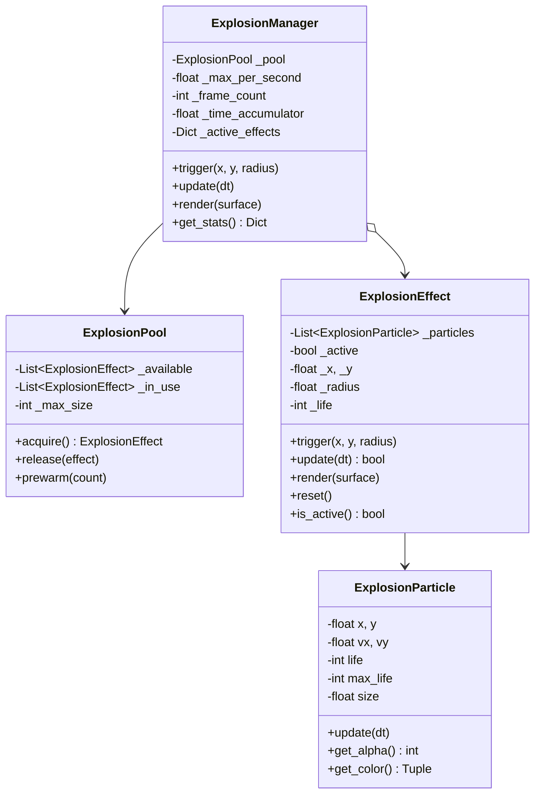
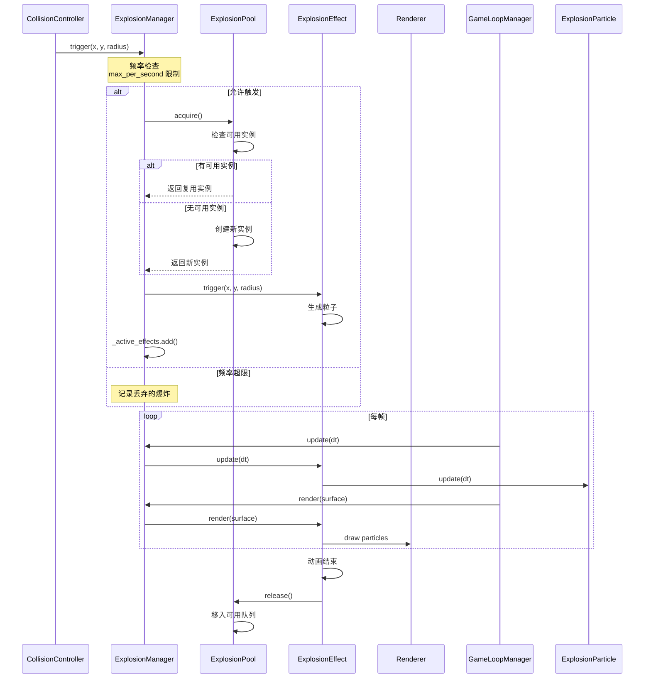

# 爆炸动画系统技术设计文档

> **文档版本：** v1.0
> **创建日期：** 2026-04-22
> **审查状态：** 待审查
> **基于设计模式原则和性能优化指南**

---

## 1. 背景与目标

### 1.1 当前实现分析

**爆炸伤害逻辑位置：** `collision_controller.py:151-172`

```python
def _handle_explosive_damage(
    self,
    bullet: 'Bullet',
    enemies: List['Enemy'],
    explosive_level: int
) -> None:
    from airwar.config import EXPLOSION_RADIUS
    from airwar.game.constants import GAME_CONSTANTS

    bullet_x = bullet.rect.centerx
    bullet_y = bullet.rect.centery
    explosion_radius_sq = (EXPLOSION_RADIUS * explosive_level) ** 2

    for enemy in enemies:
        if enemy.active:
            dx = bullet_x - enemy.rect.centerx
            dy = bullet_y - enemy.rect.centery
            distance_sq = dx * dx + dy * dy

            if distance_sq <= explosion_radius_sq:
                explosion_damage = GAME_CONSTANTS.DAMAGE.EXPLOSIVE_DAMAGE * explosive_level
                enemy.take_damage(explosion_damage)
```

**问题：**
- ❌ 只有逻辑伤害，没有任何视觉反馈
- ❌ 玩家无法感知爆炸是否发生
- ❌ 游戏体验不完整

### 1.2 目标

1. **视觉反馈**：在爆炸位置生成动画效果
2. **性能保证**：高频战斗场景下保持 60 FPS
3. **资源优化**：使用对象池避免频繁内存分配
4. **频率控制**：防止动画过多导致视觉混乱

---

## 2. 设计模式应用

### 2.1 选型依据

| 设计模式 | 适用场景 | 原因 |
|---------|---------|------|
| **Object Pool** | 粒子/动画实例管理 | 避免频繁创建销毁，减少 GC 压力 |
| **Strategy** | 爆炸效果变体 | 不同天赋等级可能需要不同爆炸效果 |
| **Observer** | 事件通知 | CollisionController 触发爆炸后通知动画系统 |
| **Facade** | 统一接口 | 为 GameLoopManager 提供简洁的动画更新/渲染接口 |

### 2.2 为什么使用 Object Pool

**症状分析（来自性能优化指南）：**
> "Pooling — High GC pressure from many short-lived objects of the same type being allocated and discarded rapidly."

**应用场景：**
- 爆炸动画在战斗中频繁触发（可能每秒 10-30 次）
- 每个爆炸包含 20-40 个粒子
- 使用对象池可减少 `allocs/op`，降低 GC 压力

**安全性检查：**
- ✅ 对象大小统一（ExplosionParticle）
- ✅ 有明确的 acquire/release 生命周期
- ✅ PyGame Surface 对象可复用

---

## 3. 系统架构

### 3.1 目录结构

```
airwar/game/
├── explosion_animation/           # 新增模块
│   ├── __init__.py
│   ├── explosion_particle.py      # 爆炸粒子类
│   ├── explosion_effect.py        # 爆炸效果类
│   ├── explosion_pool.py          # 对象池
│   └── explosion_manager.py       # 爆炸管理器（Facade）
├── death_animation/               # 复用现有模块
│   ├── __init__.py
│   └── death_animation.py
└── controllers/
    └── collision_controller.py    # 集成爆炸触发
```

### 3.2 类图



### 3.3 数据流



---

## 4. 核心组件设计

### 4.1 ExplosionParticle（爆炸粒子）

**职责：** 单个爆炸粒子的物理和视觉属性

```python
class ExplosionParticle:
    """爆炸粒子 — 表示爆炸中的一个发光点"""

    def __init__(
        self,
        x: float,
        y: float,
        vx: float,
        vy: float,
        life: int,
        max_life: int,
        size: float
    ) -> None:
        self.x = x
        self.y = y
        self.vx = vx
        self.vy = vy
        self.life = life
        self.max_life = max_life
        self.size = size

    def update(self, dt: float = 1.0) -> None:
        """更新粒子状态

        Args:
            dt: 时间增量（帧倍数），默认 1.0
        """
        self.x += self.vx * dt
        self.y += self.vy * dt
        # 轻微减速
        self.vx *= 0.98
        self.vy *= 0.98
        self.life -= 1

    def get_alpha(self) -> int:
        """获取透明度 (0-255)"""
        return int(255 * (self.life / self.max_life))

    def get_color(self) -> Tuple[int, int, int]:
        """获取颜色（随生命周期变化）

        从橙红色渐变到黄色"""
        life_ratio = self.life / self.max_life
        r = 255
        g = int(150 * life_ratio)
        b = int(30 * life_ratio)
        return (r, g, b)

    def is_alive(self) -> bool:
        """检查粒子是否存活"""
        return self.life > 0
```

**设计决策：**
- ✅ 使用 `dataclass` 太简单，保留类以支持方法
- ✅ 颜色随生命周期渐变，视觉效果更好
- ✅ 支持速度衰减，粒子不会无限飞散

### 4.2 ExplosionEffect（爆炸效果）

**职责：** 管理一组粒子的生命周期和渲染

```python
class ExplosionEffect:
    """爆炸效果 — 管理爆炸动画的完整生命周期"""

    PARTICLE_COUNT = 30           # 粒子数量
    PARTICLE_LIFE_MIN = 20        # 粒子最小寿命
    PARTICLE_LIFE_MAX = 40        # 粒子最大寿命
    PARTICLE_SPEED_MIN = 3.0      # 粒子最小速度
    PARTICLE_SPEED_MAX = 8.0      # 粒子最大速度
    PARTICLE_SIZE_MIN = 2.0       # 粒子最小尺寸
    PARTICLE_SIZE_MAX = 5.0       # 粒子最大尺寸

    def __init__(self) -> None:
        self._particles: List[ExplosionParticle] = []
        self._active = False
        self._x = 0.0
        self._y = 0.0
        self._radius = 0
        self._triggered_at = 0
        self._surface_cache = None

    def trigger(self, x: float, y: float, radius: int) -> None:
        """触发爆炸效果

        Args:
            x: 爆炸中心 X 坐标
            y: 爆炸中心 Y 坐标
            radius: 爆炸半径（像素）
        """
        self._x = x
        self._y = y
        self._radius = radius
        self._active = True
        self._particles.clear()
        self._surface_cache = None
        self._generate_particles()

    def _generate_particles(self) -> None:
        """生成爆炸粒子"""
        for _ in range(self.PARTICLE_COUNT):
            angle = random.uniform(0, 2 * math.pi)
            speed = random.uniform(
                self.PARTICLE_SPEED_MIN,
                self.PARTICLE_SPEED_MAX
            )
            life = random.randint(
                self.PARTICLE_LIFE_MIN,
                self.PARTICLE_LIFE_MAX
            )
            size = random.uniform(
                self.PARTICLE_SIZE_MIN,
                self.PARTICLE_SIZE_MAX
            )

            self._particles.append(ExplosionParticle(
                x=self._x,
                y=self._y,
                vx=math.cos(angle) * speed,
                vy=math.sin(angle) * speed,
                life=life,
                max_life=life,
                size=size
            ))

    def update(self, dt: float = 1.0) -> bool:
        """更新爆炸状态

        Args:
            dt: 时间增量

        Returns:
            True 如果爆炸仍在进行，False 如果已结束
        """
        if not self._active:
            return False

        for particle in self._particles:
            particle.update(dt)

        # 移除死亡粒子
        self._particles = [p for p in self._particles if p.is_alive()]

        # 所有粒子死亡后，爆炸结束
        if not self._particles:
            self._active = False
            return False

        return True

    def render(self, surface: pygame.Surface) -> None:
        """渲染爆炸效果

        Args:
            surface: PyGame 渲染表面
        """
        if not self._active:
            return

        # 渲染爆炸半径光晕
        self._render_radius_indicator(surface)

        # 渲染粒子
        for particle in self._particles:
            self._render_particle(surface, particle)

    def _render_radius_indicator(self, surface: pygame.Surface) -> None:
        """渲染爆炸半径指示器"""
        if self._radius <= 0:
            return

        # 绘制淡出的圆形边界
        alpha = int(100 * (len(self._particles) / self.PARTICLE_COUNT))
        if alpha < 5:
            return

        radius_surf = pygame.Surface(
            (self._radius * 2 + 20, self._radius * 2 + 20),
            pygame.SRCALPHA
        )
        pygame.draw.circle(
            radius_surf,
            (255, 100, 30, alpha),
            (self._radius + 10, self._radius + 10),
            self._radius,
            2
        )
        surface.blit(
            radius_surf,
            (self._x - self._radius - 10, self._y - self._radius - 10)
        )

    def _render_particle(
        self,
        surface: pygame.Surface,
        particle: ExplosionParticle
    ) -> None:
        """渲染单个粒子"""
        alpha = particle.get_alpha()
        if alpha < 10:
            return

        color = particle.get_color()

        # 渲染发光核心
        glow_radius = int(particle.size * 2)
        if glow_radius > 0:
            glow_surf = pygame.Surface(
                (glow_radius * 2, glow_radius * 2),
                pygame.SRCALPHA
            )
            pygame.draw.circle(
                glow_surf,
                (*color, int(alpha * 0.3)),
                (glow_radius, glow_radius),
                glow_radius
            )
            surface.blit(
                glow_surf,
                (int(particle.x) - glow_radius, int(particle.y) - glow_radius)
            )

        # 渲染粒子核心
        pygame.draw.circle(
            surface,
            color,
            (int(particle.x), int(particle.y)),
            max(1, int(particle.size * (alpha / 255)))
        )

    def reset(self) -> None:
        """重置效果实例（归还池之前调用）"""
        self._particles.clear()
        self._active = False
        self._x = 0.0
        self._y = 0.0
        self._radius = 0

    def is_active(self) -> bool:
        """检查爆炸效果是否活跃"""
        return self._active
```

**设计决策：**
- ✅ 复用 `SparkParticle` 模式，但简化参数
- ✅ 包含爆炸半径指示器，与逻辑伤害区域对应
- ✅ `reset()` 方法支持对象池回收

### 4.3 ExplosionPool（对象池）

**职责：** 管理 ExplosionEffect 实例的复用

```python
class ExplosionPool:
    """爆炸效果对象池 — 复用 ExplosionEffect 实例"""

    DEFAULT_MAX_SIZE = 20  # 默认最大池大小

    def __init__(self, max_size: int = DEFAULT_MAX_SIZE) -> None:
        self._max_size = max_size
        self._available: List[ExplosionEffect] = []
        self._in_use: List[ExplosionEffect] = []

        # 预热池
        self._prewarm(min(5, max_size))

    def _prewarm(self, count: int) -> None:
        """预热池 — 预先创建实例"""
        for _ in range(count):
            self._available.append(ExplosionEffect())

    def acquire(self) -> ExplosionEffect:
        """获取爆炸效果实例

        Returns:
            ExplosionEffect 实例

        Note:
            如果池已满且所有实例都在使用中，返回 None
        """
        if self._available:
            effect = self._available.pop()
            self._in_use.append(effect)
            return effect
        elif len(self._in_use) < self._max_size:
            # 超出预热数量，创建新实例
            effect = ExplosionEffect()
            self._in_use.append(effect)
            return effect
        else:
            # 池已满，所有实例都在使用
            return None

    def release(self, effect: ExplosionEffect) -> None:
        """归还爆炸效果实例到池中

        Args:
            effect: 要归还的实例
        """
        if effect in self._in_use:
            self._in_use.remove(effect)
            effect.reset()
            self._available.append(effect)

    def update(self) -> int:
        """更新池中所有活跃效果的状态

        Returns:
            当前活跃的爆炸效果数量
        """
        # 分离活跃和非活跃效果
        still_active = []
        for effect in self._in_use:
            if effect.is_active() and effect.update():
                still_active.append(effect)
            else:
                self.release(effect)

        self._in_use = still_active
        return len(still_active)

    def get_stats(self) -> Dict[str, int]:
        """获取池统计信息"""
        return {
            'available': len(self._available),
            'in_use': len(self._in_use),
            'total': len(self._available) + len(self._in_use),
            'max_size': self._max_size
        }

    def get_active_effects(self) -> List[ExplosionEffect]:
        """获取当前所有活跃效果"""
        return [e for e in self._in_use if e.is_active()]
```

**设计决策：**
- ✅ 符合 Object Pool 模式的 acquire/release 语义
- ✅ 预热机制减少运行时分配
- ✅ 提供统计信息用于监控

### 4.4 ExplosionManager（管理器 - Facade）

**职责：** 统一接口，封装频率控制和协调

```python
class ExplosionManager:
    """爆炸管理器 — 提供统一的爆炸触发和更新接口"""

    DEFAULT_MAX_PER_SECOND = 30.0  # 默认最大每秒爆炸数

    def __init__(
        self,
        max_per_second: float = DEFAULT_MAX_PER_SECOND,
        pool_max_size: int = 20
    ) -> None:
        self._pool = ExplosionPool(max_size=pool_max_size)
        self._max_per_second = max_per_second
        self._time_accumulator = 0.0
        self._explosions_this_second = 0
        self._dropped_explosions = 0
        self._total_explosions = 0

    def trigger(
        self,
        x: float,
        y: float,
        radius: int
    ) -> bool:
        """触发爆炸效果

        Args:
            x: 爆炸中心 X 坐标
            y: 爆炸中心 Y 坐标
            radius: 爆炸半径（像素）

        Returns:
            True 如果成功触发，False 如果被频率限制丢弃
        """
        # 频率检查
        if self._explosions_this_second >= self._max_per_second:
            self._dropped_explosions += 1
            return False

        # 从池中获取实例
        effect = self._pool.acquire()
        if effect is None:
            # 池已满
            self._dropped_explosions += 1
            return False

        # 触发效果
        effect.trigger(x, y, radius)
        self._explosions_this_second += 1
        self._total_explosions += 1

        return True

    def update(self, dt: float = 1.0) -> None:
        """更新爆炸系统状态

        Args:
            dt: 时间增量
        """
        # 更新时间累积器
        self._time_accumulator += dt

        # 每秒重置计数器
        if self._time_accumulator >= 60:  # 假设 60 FPS
            self._explosions_this_second = 0
            self._time_accumulator = 0.0

        # 更新池中效果
        self._pool.update()

    def render(self, surface: pygame.Surface) -> None:
        """渲染所有活跃爆炸效果

        Args:
            surface: PyGame 渲染表面
        """
        for effect in self._pool.get_active_effects():
            effect.render(surface)

    def get_stats(self) -> Dict[str, Any]:
        """获取性能统计信息"""
        pool_stats = self._pool.get_stats()
        return {
            **pool_stats,
            'max_per_second': self._max_per_second,
            'explosions_this_second': self._explosions_this_second,
            'dropped_explosions': self._dropped_explosions,
            'total_explosions': self._total_explosions,
            'active_count': len(self._pool.get_active_effects())
        }

    def reset_stats(self) -> None:
        """重置统计信息"""
        self._dropped_explosions = 0
        self._total_explosions = 0
```

**设计决策：**
- ✅ Facade 模式隐藏内部复杂性
- ✅ 频率限制策略：丢弃超出限制的爆炸
- ✅ 提供详细统计用于性能监控

---

## 5. 与 CollisionController 集成

### 5.1 修改方案

**方案选择：** 依赖注入（Dependency Injection）

**原因：**
1. CollisionController 不应该创建 ExplosionManager
2. ExplosionManager 应该由 GameLoopManager 创建和管理
3. CollisionController 只负责触发爆炸事件

### 5.2 具体实现

**collision_controller.py 修改：**

```python
class CollisionController:
    def __init__(self):
        self._events: List[CollisionEvent] = []
        self._explosion_callback: Optional[Callable] = None  # 新增

    def set_explosion_callback(
        self,
        callback: Callable[[float, float, int], None]
    ) -> None:
        """设置爆炸回调函数

        Args:
            callback: 回调函数，签名为 (x, y, radius) -> None
        """
        self._explosion_callback = callback

    def _handle_explosive_damage(
        self,
        bullet: 'Bullet',
        enemies: List['Enemy'],
        explosive_level: int
    ) -> None:
        from airwar.config import EXPLOSION_RADIUS
        from airwar.game.constants import GAME_CONSTANTS

        bullet_x = bullet.rect.centerx
        bullet_y = bullet.rect.centery
        explosion_radius_sq = (EXPLOSION_RADIUS * explosive_level) ** 2
        explosion_radius = EXPLOSION_RADIUS * explosive_level

        for enemy in enemies:
            if enemy.active:
                dx = bullet_x - enemy.rect.centerx
                dy = bullet_y - enemy.rect.centery
                distance_sq = dx * dx + dy * dy

                if distance_sq <= explosion_radius_sq:
                    explosion_damage = GAME_CONSTANTS.DAMAGE.EXPLOSIVE_DAMAGE * explosive_level
                    enemy.take_damage(explosion_damage)

                    # 触发视觉爆炸（只触发一次）
                    if self._explosion_callback and distance_sq == 0:
                        self._explosion_callback(bullet_x, bullet_y, explosion_radius)
                        self._explosion_callback = None  # 只触发一次
```

**game_loop_manager.py 修改：**

```python
class GameLoopManager:
    def __init__(
        self,
        # ... 现有参数 ...
        explosion_manager: Optional[ExplosionManager] = None  # 新增
    ):
        # ... 现有初始化 ...
        self._explosion_manager = explosion_manager or ExplosionManager()

        # 设置爆炸回调
        self._collision_controller.set_explosion_callback(
            self._on_explosion
        )

    def _on_explosion(self, x: float, y: float, radius: int) -> None:
        """爆炸回调"""
        self._explosion_manager.trigger(x, y, radius)

    def _update_core(self, dt: float) -> None:
        # ... 现有代码 ...

        # 更新爆炸动画
        self._explosion_manager.update(dt)

    def render(self, surface: pygame.Surface) -> None:
        # ... 现有渲染代码 ...

        # 渲染爆炸动画（在所有实体之上）
        self._explosion_manager.render(surface)
```

---

## 6. 性能优化策略

### 6.1 频率限制算法

**当前实现：** 简单计数

```python
# 每秒最大爆炸数
if self._explosions_this_second >= self._max_per_second:
    # 丢弃
    return False
```

**问题：** 可能导致视觉不平滑

**改进方案：** 时间窗口加权（未来考虑）

```python
# 使用时间窗口记录最近的爆炸时间
self._explosion_times: List[float] = []

def trigger(self, x, y, radius) -> bool:
    current_time = pygame.time.get_ticks()

    # 移除超过 1 秒的时间戳
    self._explosion_times = [
        t for t in self._explosion_times
        if current_time - t < 1000
    ]

    if len(self._explosion_times) >= self._max_per_second:
        return False

    self._explosion_times.append(current_time)
    # ... 触发爆炸 ...
```

### 6.2 粒子数量自适应

**基于爆炸频率的动态调整：**

```python
class ExplosionEffect:
    def _generate_particles(self) -> None:
        # 活跃爆炸多时，减少粒子数
        if active_explosions > 10:
            count = int(self.PARTICLE_COUNT * 0.5)
        elif active_explosions > 5:
            count = int(self.PARTICLE_COUNT * 0.75)
        else:
            count = self.PARTICLE_COUNT

        for _ in range(count):
            # ... 生成粒子 ...
```

### 6.3 Surface 缓存

**复用 PyGame Surface：**

```python
class ExplosionEffect:
    def __init__(self) -> None:
        # ... 其他初始化 ...
        self._glow_surf_cache = None
        self._glow_surf_size = 0

    def _get_glow_surface(self, radius: int) -> pygame.Surface:
        """获取或创建发光表面缓存"""
        if (self._glow_surf_cache is None or
            self._glow_surf_size != radius):
            size = radius * 2
            self._glow_surf_cache = pygame.Surface(
                (size, size),
                pygame.SRCALPHA
            )
            self._glow_surf_size = radius

        self._glow_surf_cache.fill((0, 0, 0, 0))
        return self._glow_surf_cache
```

---

## 7. 配置参数

### 7.1 可配置项

| 参数 | 默认值 | 说明 | 建议范围 |
|------|--------|------|---------|
| `MAX_PER_SECOND` | 30 | 每秒最大爆炸数 | 15-60 |
| `POOL_MAX_SIZE` | 20 | 对象池最大实例数 | 10-50 |
| `PARTICLE_COUNT` | 30 | 每个爆炸的粒子数 | 15-50 |
| `PARTICLE_LIFE_MIN` | 20 | 粒子最小寿命（帧） | 10-30 |
| `PARTICLE_LIFE_MAX` | 40 | 粒子最大寿命（帧） | 30-60 |
| `EXPLOSION_RADIUS_INDICATOR` | True | 是否显示半径指示器 | True/False |

### 7.2 性能目标

| 指标 | 目标值 | 测量方法 |
|------|--------|---------|
| FPS | ≥ 58 | `pygame.time.Clock.get_fps()` |
| 内存增长 | < 1MB/min | `psutil.Process().memory_info()` |
| 每帧渲染时间 | < 2ms | `time.perf_counter()` |
| 对象池命中率 | > 90% | 统计 acquire 次数 vs 创建次数 |

---

## 8. 测试计划

### 8.1 单元测试

```python
def test_explosion_particle_lifecycle():
    """测试粒子生命周期"""
    particle = ExplosionParticle(x=0, y=0, vx=1, vy=1, life=10, max_life=10, size=2)
    assert particle.is_alive()

    for _ in range(10):
        particle.update()

    assert not particle.is_alive()

def test_explosion_effect_trigger():
    """测试爆炸效果触发"""
    effect = ExplosionEffect()
    assert not effect.is_active()

    effect.trigger(x=100, y=100, radius=50)
    assert effect.is_active()
    assert len(effect._particles) == 30

def test_object_pool_acquire_release():
    """测试对象池获取和归还"""
    pool = ExplosionPool(max_size=5)

    # 获取
    effect1 = pool.acquire()
    assert effect1 is not None
    assert len(pool._available) == 4
    assert len(pool._in_use) == 1

    # 归还
    pool.release(effect1)
    assert len(pool._available) == 5
    assert len(pool._in_use) == 0

def test_frequency_limiting():
    """测试频率限制"""
    manager = ExplosionManager(max_per_second=3)

    # 前 3 次应该成功
    for i in range(3):
        assert manager.trigger(100, 100, 50) is True

    # 第 4 次应该失败
    assert manager.trigger(100, 100, 50) is False

    stats = manager.get_stats()
    assert stats['dropped_explosions'] == 1
```

### 8.2 集成测试

```python
def test_collision_triggers_explosion():
    """测试碰撞触发爆炸"""
    from airwar.game.explosion_animation.explosion_manager import ExplosionManager

    manager = ExplosionManager(max_per_second=100)
    collision = CollisionController()
    collision.set_explosion_callback(
        lambda x, y, r: manager.trigger(x, y, r)
    )

    # 模拟碰撞
    # ... 触发 _handle_explosive_damage ...

    stats = manager.get_stats()
    assert stats['total_explosions'] > 0
```

### 8.3 性能测试

```python
def test_performance_high_frequency():
    """测试高频爆炸场景性能"""
    import pygame
    pygame.init()

    screen = pygame.display.set_mode((800, 600))
    manager = ExplosionManager(max_per_second=30)

    clock = pygame.time.Clock()

    # 模拟 60 秒高频爆炸
    for frame in range(60 * 60):  # 60 秒 @ 60 FPS
        # 每帧触发 2-5 次爆炸
        for _ in range(random.randint(2, 5)):
            manager.trigger(random.randint(0, 800), random.randint(0, 600), 50)

        manager.update()
        manager.render(screen)

        fps = clock.get_fps()
        if frame % 300 == 0:
            print(f"FPS: {fps:.1f}, Stats: {manager.get_stats()}")

        clock.tick(60)

    pygame.quit()
```

---

## 9. 风险评估

| 风险 | 等级 | 缓解措施 |
|------|------|---------|
| 频率限制导致视觉缺失 | 中 | 提供配置接口，让玩家调整 |
| 对象池耗尽 | 低 | 设置合理的池大小和上限 |
| 粒子渲染影响 FPS | 中 | 实现粒子数量自适应 |
| 与死亡动画冲突 | 低 | 使用不同的渲染层 |
| 内存泄漏 | 低 | 确保 `reset()` 正确调用 |

---

## 10. 未来扩展

1. **爆炸效果变体**
   - 不同天赋等级显示不同效果
   - 普通爆炸：橙红色
   - 强化爆炸：蓝色/紫色

2. **爆炸声音反馈**
   - 集成 PyGame 音频系统
   - 根据爆炸强度调整音量

3. **屏幕震动**
   - 大爆炸触发轻微屏幕震动
   - 提升打击感

4. **爆炸特效组合**
   - 与其他天赋（Rapid Fire, Power Shot）联动
   - 触发特殊视觉效果

---

## 11. 验收标准检查清单

- [ ] 爆炸动画在子弹命中时正确触发
- [ ] 爆炸半径与技能设定完全匹配
- [ ] 动画视觉清晰直观
- [ ] 频率限制正常工作
- [ ] 对象池正常工作，无内存泄漏
- [ ] 60 FPS 战斗场景下性能稳定
- [ ] 统计信息正确显示
- [ ] 单元测试全部通过
- [ ] 集成测试通过
- [ ] 性能测试达标

---

**文档状态：** 待审查后实施
**下一步：** 用户审核后开始实现
