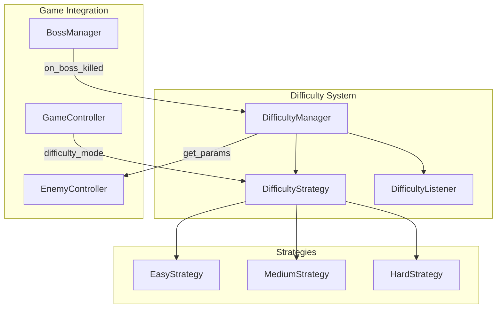
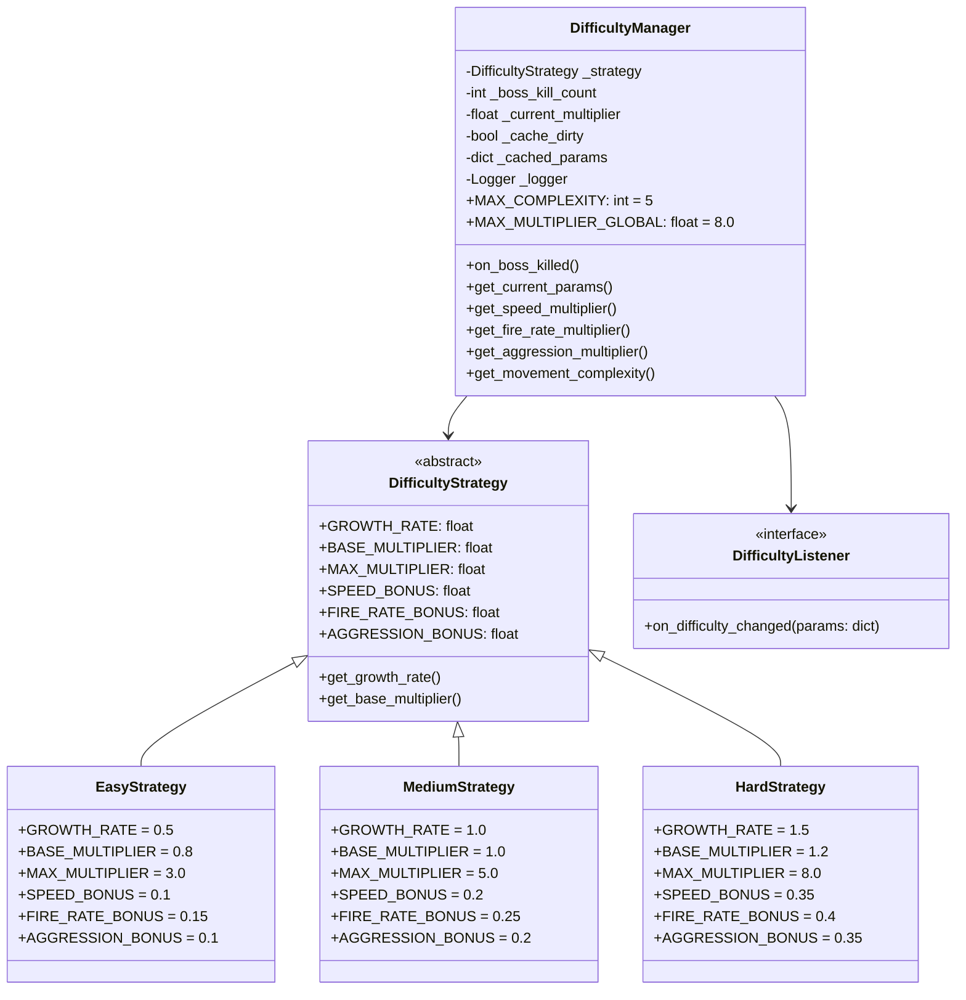
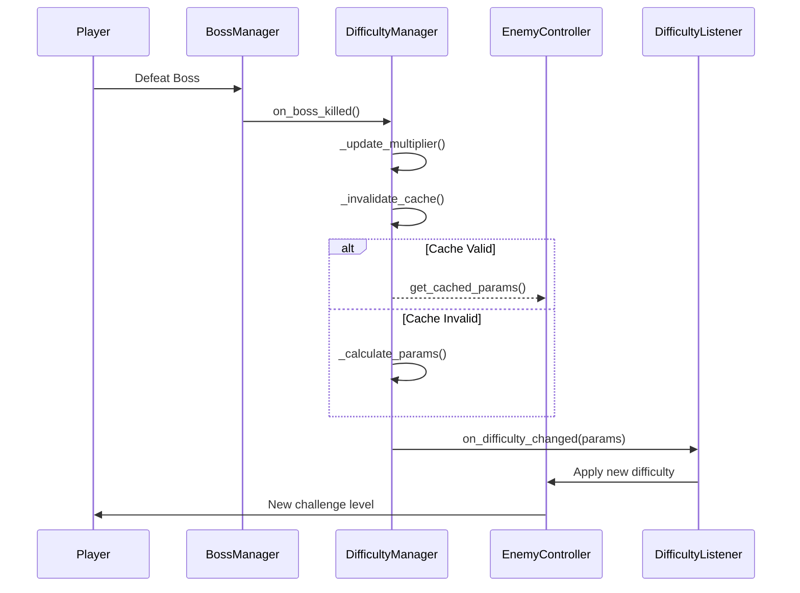

# 非线性难度系统设计文档 v2.0

> **文档版本：** v2.0
> **创建日期：** 2026-04-22
> **状态：** 正式版
> **设计模式：** Strategy Pattern + Observer Pattern
> **审查状态：** 已通过代码审查

---

## 1. 概述

### 1.1 设计目标

本系统旨在实现一个**非线性增长的动态难度系统**，根据玩家击杀 Boss 的数量动态调整游戏难度，使游戏体验更具挑战性和 replay value。

### 1.2 用户需求

| 需求项 | 描述 |
|--------|------|
| 非线性增长 | 难度增长速度随 Boss 击杀数呈指数增长 |
| Boss 触发 | 每次成功击杀 Boss 触发一次难度调整 |
| 增长公式 | 第 N 次：+1, +2, +4, +8, +16... (2^(N-1)) |
| 影响范围 | 移动速度、移动轨迹、攻击欲望、子弹发射频率 |
| 模式差异 | 简单/普通/困难 三档，递进明显 |

### 1.3 设计原则

1. **DRY 原则**：通过类属性代替方法，减少策略类代码重复
2. **最小化魔法数字**：所有配置使用类常量
3. **输入验证**：所有公开方法包含边界检查
4. **可观测性**：集成日志记录系统
5. **配置分离**：难度参数从配置文件读取
6. **现有系统兼容**：复用 `cycle_count` 而非引入新变量

---

## 2. 系统架构

### 2.1 架构概览



### 2.2 类图



### 2.3 数据流



---

## 3. 配置文件

### 3.1 难度配置文件

```python
# airwar/config/difficulty_config.py

DIFFICULTY_CONFIGS = {
    'easy': {
        'growth_rate': 0.5,
        'base_multiplier': 0.8,
        'max_multiplier': 3.0,
        'speed_bonus': 0.1,
        'fire_rate_bonus': 0.15,
        'aggression_bonus': 0.1,
    },
    'medium': {
        'growth_rate': 1.0,
        'base_multiplier': 1.0,
        'max_multiplier': 5.0,
        'speed_bonus': 0.2,
        'fire_rate_bonus': 0.25,
        'aggression_bonus': 0.2,
    },
    'hard': {
        'growth_rate': 1.5,
        'base_multiplier': 1.2,
        'max_multiplier': 8.0,
        'speed_bonus': 0.35,
        'fire_rate_bonus': 0.4,
        'aggression_bonus': 0.35,
    },
}

MOVEMENT_PATTERNS = {
    1: ['straight'],
    2: ['straight', 'sine'],
    3: ['straight', 'sine', 'zigzag'],
    4: ['straight', 'sine', 'zigzag', 'hover'],
    5: ['straight', 'sine', 'zigzag', 'hover', 'spiral'],
}

BASE_ENEMY_PARAMS = {
    'speed': 3.0,
    'fire_rate': 120,
    'aggression': 0.5,
    'spawn_rate': 30,
}
```

---

## 4. 核心实现

### 4.1 难度策略基类

```python
# airwar/game/systems/difficulty_strategies.py

from abc import ABC
import logging


class DifficultyStrategy(ABC):
    """难度策略基类

    使用类属性代替方法，减少子类重复代码。
    策略参数从配置文件加载。
    """

    GROWTH_RATE: float = 1.0
    BASE_MULTIPLIER: float = 1.0
    MAX_MULTIPLIER: float = 5.0
    SPEED_BONUS: float = 0.2
    FIRE_RATE_BONUS: float = 0.25
    AGGRESSION_BONUS: float = 0.2

    def get_growth_rate(self) -> float:
        """获取增长率"""
        return self.GROWTH_RATE

    def get_base_multiplier(self) -> float:
        """获取基础倍数"""
        return self.BASE_MULTIPLIER

    def get_max_multiplier(self) -> float:
        """获取最大倍数上限"""
        return self.MAX_MULTIPLIER

    def get_speed_bonus(self) -> float:
        """获取速度加成系数"""
        return self.SPEED_BONUS

    def get_fire_rate_bonus(self) -> float:
        """获取射速加成系数"""
        return self.FIRE_RATE_BONUS

    def get_aggression_bonus(self) -> float:
        """获取攻击欲望加成系数"""
        return self.AGGRESSION_BONUS


class EasyStrategy(DifficultyStrategy):
    """简单模式策略"""
    GROWTH_RATE = 0.5
    BASE_MULTIPLIER = 0.8
    MAX_MULTIPLIER = 3.0
    SPEED_BONUS = 0.1
    FIRE_RATE_BONUS = 0.15
    AGGRESSION_BONUS = 0.1


class MediumStrategy(DifficultyStrategy):
    """普通模式策略"""
    GROWTH_RATE = 1.0
    BASE_MULTIPLIER = 1.0
    MAX_MULTIPLIER = 5.0
    SPEED_BONUS = 0.2
    FIRE_RATE_BONUS = 0.25
    AGGRESSION_BONUS = 0.2


class HardStrategy(DifficultyStrategy):
    """困难模式策略"""
    GROWTH_RATE = 1.5
    BASE_MULTIPLIER = 1.2
    MAX_MULTIPLIER = 8.0
    SPEED_BONUS = 0.35
    FIRE_RATE_BONUS = 0.4
    AGGRESSION_BONUS = 0.35


class DifficultyStrategyFactory:
    """难度策略工厂"""

    _STRATEGIES = {
        'easy': EasyStrategy,
        'medium': MediumStrategy,
        'hard': HardStrategy,
    }

    @classmethod
    def create(cls, difficulty: str) -> DifficultyStrategy:
        """创建难度策略

        Args:
            difficulty: 难度名称 ('easy', 'medium', 'hard')

        Returns:
            DifficultyStrategy: 难度策略实例

        Raises:
            ValueError: 当难度名称无效时
        """
        if difficulty not in cls._STRATEGIES:
            logging.warning(f"Invalid difficulty '{difficulty}', defaulting to 'medium'")
            difficulty = 'medium'

        return cls._STRATEGIES[difficulty]()
```

### 4.2 难度管理器

```python
# airwar/game/systems/difficulty_manager.py

from typing import List, Dict, Optional
import logging

from airwar.game.systems.difficulty_strategies import (
    DifficultyStrategy,
    DifficultyStrategyFactory,
)


class DifficultyListener:
    """难度变化监听器接口"""

    def on_difficulty_changed(self, params: Dict) -> None:
        """难度变化时调用

        Args:
            params: 新的难度参数
        """
        raise NotImplementedError


class DifficultyManager:
    """难度管理器

    核心职责：
    1. 管理难度增长（指数增长算法）
    2. 计算敌人参数
    3. 通知监听器
    4. 缓存计算结果

    设计特点：
    - 复用现有 cycle_count，避免引入新变量
    - 参数缓存优化，减少重复计算
    - 完整的日志记录
    - 边界检查防止异常值
    """

    MAX_COMPLEXITY: int = 5
    MAX_MULTIPLIER_GLOBAL: float = 8.0
    MAX_BOSS_COUNT: int = 20

    def __init__(self, difficulty: str = 'medium') -> None:
        """初始化难度管理器

        Args:
            difficulty: 难度模式 ('easy', 'medium', 'hard')
        """
        self._logger = logging.getLogger(self.__class__.__name__)
        self._strategy = DifficultyStrategyFactory.create(difficulty)
        self._boss_kill_count: int = 0
        self._current_multiplier: float = self._strategy.get_base_multiplier()
        self._cache_dirty: bool = True
        self._cached_params: Optional[Dict] = None
        self._listeners: List[DifficultyListener] = []

        self._logger.info(f"DifficultyManager initialized with difficulty: {difficulty}")

    def set_boss_kill_count(self, count: int) -> None:
        """设置 Boss 击杀数（用于与 GameController 同步）

        Args:
            count: Boss 击杀数

        Raises:
            ValueError: 当 count 为负数时
        """
        if count < 0:
            raise ValueError("boss_kill_count cannot be negative")

        if count != self._boss_kill_count:
            self._boss_kill_count = min(count, self.MAX_BOSS_COUNT)
            self._update_multiplier()
            self._logger.debug(
                f"Boss kill count updated: {self._boss_kill_count}, "
                f"multiplier: {self._current_multiplier:.2f}"
            )

    def get_boss_kill_count(self) -> int:
        """获取当前 Boss 击杀数"""
        return self._boss_kill_count

    def on_boss_killed(self) -> None:
        """Boss 被击杀时调用 - 更新难度

        与 GameController.cycle_count 保持同步。
        """
        self._boss_kill_count += 1
        self._boss_kill_count = min(self._boss_kill_count, self.MAX_BOSS_COUNT)

        old_multiplier = self._current_multiplier
        self._update_multiplier()

        self._logger.info(
            f"Boss #{self._boss_kill_count} killed - "
            f"multiplier: {old_multiplier:.2f} -> {self._current_multiplier:.2f}"
        )

        self._notify_listeners()

    def _update_multiplier(self) -> None:
        """更新难度倍数

        使用指数增长算法：
        multiplier = base + (2^n - 1) * growth_rate
        """
        raw_multiplier = self._strategy.get_base_multiplier()

        if self._boss_kill_count > 0:
            exponential_bonus = (2 ** self._boss_kill_count - 1)
            raw_multiplier += exponential_bonus * self._strategy.get_growth_rate()

        self._current_multiplier = min(
            raw_multiplier,
            self._strategy.get_max_multiplier()
        )
        self._cache_dirty = True

    def get_current_multiplier(self) -> float:
        """获取当前难度倍数"""
        return self._current_multiplier

    def get_speed_multiplier(self) -> float:
        """获取敌人速度倍数"""
        return 1.0 + (self._current_multiplier - 1) * self._strategy.get_speed_bonus()

    def get_fire_rate_multiplier(self) -> float:
        """获取攻击频率倍数（越高越快）"""
        return 1.0 + (self._current_multiplier - 1) * self._strategy.get_fire_rate_bonus()

    def get_aggression_multiplier(self) -> float:
        """获取攻击欲望倍数"""
        return 1.0 + (self._current_multiplier - 1) * self._strategy.get_aggression_bonus()

    def get_movement_complexity(self) -> int:
        """获取移动轨迹复杂度 (1-MAX_COMPLEXITY)"""
        return min(self.MAX_COMPLEXITY, 1 + self._boss_kill_count // 2)

    def get_current_params(self) -> Dict:
        """获取当前难度下的敌人参数（带缓存）"""
        if self._cache_dirty or self._cached_params is None:
            self._cached_params = self._calculate_params()
            self._cache_dirty = False

        return self._cached_params.copy()

    def _calculate_params(self) -> Dict:
        """计算敌人参数"""
        from airwar.config.difficulty_config import BASE_ENEMY_PARAMS

        speed_mult = self.get_speed_multiplier()
        fire_mult = self.get_fire_rate_multiplier()
        aggro_mult = self.get_aggression_multiplier()

        return {
            'speed': BASE_ENEMY_PARAMS['speed'] * speed_mult,
            'fire_rate': max(30, int(BASE_ENEMY_PARAMS['fire_rate'] / fire_mult)),
            'aggression': min(1.0, BASE_ENEMY_PARAMS['aggression'] * aggro_mult),
            'spawn_rate': max(10, int(BASE_ENEMY_PARAMS['spawn_rate'] / (1 + speed_mult * 0.1))),
            'multiplier': self._current_multiplier,
            'boss_kills': self._boss_kill_count,
            'complexity': self.get_movement_complexity(),
        }

    def _invalidate_cache(self) -> None:
        """使缓存失效"""
        self._cache_dirty = True

    def add_listener(self, listener: DifficultyListener) -> None:
        """添加难度变化监听器

        Args:
            listener: 实现 DifficultyListener 接口的对象
        """
        if listener not in self._listeners:
            self._listeners.append(listener)
            self._logger.debug(f"Listener added: {listener.__class__.__name__}")

    def remove_listener(self, listener: DifficultyListener) -> None:
        """移除难度变化监听器

        Args:
            listener: 要移除的监听器
        """
        if listener in self._listeners:
            self._listeners.remove(listener)
            self._logger.debug(f"Listener removed: {listener.__class__.__name__}")

    def _notify_listeners(self) -> None:
        """通知所有监听器"""
        params = self.get_current_params()
        for listener in self._listeners:
            try:
                listener.on_difficulty_changed(params)
            except Exception as e:
                self._logger.error(
                    f"Error notifying listener {listener.__class__.__name__}: {e}"
                )
```

### 4.3 移动轨迹生成器

```python
# airwar/game/systems/movement_pattern_generator.py

import random
from typing import Dict, List

from airwar.config.difficulty_config import MOVEMENT_PATTERNS


class MovementPatternGenerator:
    """移动轨迹模式生成器

    根据难度复杂度选择和增强移动模式。
    """

    @classmethod
    def get_pattern(cls, complexity: int) -> str:
        """根据复杂度获取移动模式

        Args:
            complexity: 移动复杂度 (1-5)

        Returns:
            str: 移动模式名称
        """
        complexity = max(1, min(complexity, len(MOVEMENT_PATTERNS)))
        available_patterns = MOVEMENT_PATTERNS.get(complexity, ['straight'])
        return random.choice(available_patterns)

    @classmethod
    def enhance_pattern(cls, pattern: str, difficulty: float) -> Dict:
        """增强移动模式参数

        Args:
            pattern: 原始模式名称
            difficulty: 难度倍数

        Returns:
            Dict: 增强后的参数
        """
        base_enhancement = difficulty - 1.0

        enhancements = {
            'straight': {
                'speed_multiplier': 1.0 + base_enhancement * 0.3,
            },
            'sine': {
                'amplitude_multiplier': 1.0 + base_enhancement * 0.2,
                'frequency_multiplier': 1.0 + base_enhancement * 0.1,
            },
            'zigzag': {
                'speed_multiplier': 1.0 + base_enhancement * 0.25,
                'direction_change_multiplier': 1.0 + base_enhancement * 0.15,
            },
            'hover': {
                'hover_speed_multiplier': 1.0 + base_enhancement * 0.3,
                'amplitude_multiplier': 1.0 + base_enhancement * 0.2,
            },
            'spiral': {
                'spiral_speed_multiplier': 1.0 + base_enhancement * 0.35,
                'spiral_tightness': 1.0 + base_enhancement * 0.1,
            },
        }

        return enhancements.get(pattern, {'speed_multiplier': 1.0})
```

---

## 5. 游戏集成

### 5.1 集成 GameController

```python
# airwar/game/controllers/game_controller.py 修改

class GameController:
    def __init__(self, difficulty: str, username: str):
        # ... 现有初始化代码 ...

        # 新增：难度管理器（与 cycle_count 同步）
        from airwar.game.systems.difficulty_manager import DifficultyManager
        self.difficulty_manager = DifficultyManager(difficulty)

    def on_boss_killed(self, score_gained: int) -> None:
        # ... 现有逻辑 (score 更新等) ...

        # 同步难度管理器
        self.difficulty_manager.on_boss_killed()
```

### 5.2 集成敌人生成器

```python
# airwar/game/controllers/spawn_controller.py 修改

class SpawnController:
    def __init__(self, settings: dict):
        # ... 现有初始化代码 ...
        self._difficulty_manager = None

    def set_difficulty_manager(self, manager: 'DifficultyManager') -> None:
        """设置难度管理器

        Args:
            manager: DifficultyManager 实例
        """
        self._difficulty_manager = manager

    def get_current_params(self) -> dict:
        """获取当前难度参数"""
        if self._difficulty_manager:
            return self._difficulty_manager.get_current_params()

        from airwar.config.difficulty_config import BASE_ENEMY_PARAMS
        return {
            'speed': BASE_ENEMY_PARAMS['speed'],
            'fire_rate': BASE_ENEMY_PARAMS['fire_rate'],
            'aggression': BASE_ENEMY_PARAMS['aggression'],
            'spawn_rate': BASE_ENEMY_PARAMS['spawn_rate'],
            'multiplier': 1.0,
            'boss_kills': 0,
            'complexity': 1,
        }
```

### 5.3 集成敌人类

```python
# airwar/entities/enemy.py 修改

class Enemy(Entity):
    def __init__(self, x: float, y: float, data: EnemyData):
        # ... 现有初始化代码 ...

        self._difficulty_multiplier = 1.0
        self._fire_rate_modifier = 1.0
        self._movement_enhancements = {}

    def set_difficulty(
        self,
        speed_mult: float,
        fire_rate_modifier: float,
        movement_enhancements: dict = None
    ) -> None:
        """设置难度参数

        Args:
            speed_mult: 速度倍数
            fire_rate_modifier: 射速修正
            movement_enhancements: 移动增强参数
        """
        self._difficulty_multiplier = speed_mult
        self._fire_rate_modifier = fire_rate_modifier
        self._movement_enhancements = movement_enhancements or {}

    def update(self, *args, **kwargs) -> None:
        # 应用速度加成
        base_speed = self.data.speed
        speed_mult = self._movement_enhancements.get('speed_multiplier', 1.0)
        adjusted_speed = base_speed * self._difficulty_multiplier * speed_mult

        # 应用射速修正
        adjusted_fire_rate = self.data.fire_rate / self._fire_rate_modifier

        # ... 现有移动逻辑 ...
```

---

## 6. 难度指示器 UI

### 6.1 难度指示器实现

```python
# airwar/game/rendering/difficulty_indicator.py

import pygame


class DifficultyIndicator:
    """难度指示器 - 显示当前难度状态"""

    def __init__(self, difficulty_manager: 'DifficultyManager'):
        """初始化难度指示器

        Args:
            difficulty_manager: DifficultyManager 实例
        """
        self._manager = difficulty_manager
        self._show_details = False

    def render(self, surface: pygame.Surface) -> None:
        """渲染难度指示器

        Args:
            surface: PyGame 渲染表面
        """
        params = self._manager.get_current_params()

        bar_width = 200
        bar_height = 20
        bar_x = surface.get_width() - bar_width - 20
        bar_y = 60

        pygame.draw.rect(surface, (50, 50, 80), (bar_x, bar_y, bar_width, bar_height))

        max_mult = self._manager.MAX_MULTIPLIER_GLOBAL
        fill_width = int(bar_width * min(params['multiplier'] / max_mult, 1.0))

        color = self._get_difficulty_color(params['multiplier'])
        pygame.draw.rect(surface, color, (bar_x, bar_y, fill_width, bar_height))

        font = pygame.font.Font(None, 24)
        text = f"DMG: {params['multiplier']:.1f}x"
        text_surf = font.render(text, True, (255, 255, 255))
        surface.blit(text_surf, (bar_x, bar_y - 25))

        if self._show_details:
            self._render_details(surface, params, bar_x, bar_y + bar_height + 10)

    def _get_difficulty_color(self, multiplier: float) -> tuple:
        """根据难度倍数获取颜色"""
        if multiplier < 2.0:
            return (100, 255, 100)
        elif multiplier < 4.0:
            return (255, 255, 100)
        elif multiplier < 6.0:
            return (255, 150, 50)
        else:
            return (255, 50, 50)

    def _render_details(self, surface, params: dict, x: int, y: int) -> None:
        """渲染详细信息"""
        font = pygame.font.Font(None, 18)
        lines = [
            f"Boss Kills: {params['boss_kills']}",
            f"Speed: {params['speed']:.1f}",
            f"Fire Rate: {params['fire_rate']}",
            f"Aggression: {params['aggression']:.2f}",
            f"Spawn: {params['spawn_rate']}",
            f"Complexity: {params['complexity']}",
        ]

        for i, line in enumerate(lines):
            text_surf = font.render(line, True, (200, 200, 200))
            surface.blit(text_surf, (x, y + i * 18))
```

---

## 7. 难度增长曲线

### 7.1 三种模式对比

| 参数 | 简单模式 | 普通模式 | 困难模式 |
|------|---------|---------|---------|
| **增长率** | 0.5 | 1.0 | 1.5 |
| **基础倍数** | 0.8 | 1.0 | 1.2 |
| **最大倍数** | 3.0 | 5.0 | 8.0 |
| **速度加成** | 10% | 20% | 35% |
| **射速加成** | 15% | 25% | 40% |
| **攻击欲望加成** | 10% | 20% | 35% |

### 7.2 增长曲线表

| Boss 击杀数 | 简单模式 | 普通模式 | 困难模式 |
|-------------|----------|----------|----------|
| 0 | 0.8x | 1.0x | 1.2x |
| 1 | 1.3x | 2.0x | 2.7x |
| 2 | 2.3x | 4.0x | 5.7x |
| 3 | 4.3x (上限 3.0x) | 8.0x (上限 5.0x) | 10.7x (上限 8.0x) |
| 4 | 3.0x (上限) | 5.0x (上限) | 8.0x (上限) |

### 7.3 可视化曲线

```
难度倍数
    │
 8.0├─────────────────────────────────────────────── 困难上限
    │                                          ╱
 5.0├─────────────────────────────╱─────────── 普通上限
    │                      ╱      ╱
 3.0├─────────╱────────╱────────╱─────────────── 简单上限
    │        ╱        ╱      ╱
 1.0├───────╱────────╱──────╱────────────────── 基础线
    │
 0.0└──────────────────────────────────────────────
        0   1   2   3   4   Boss击杀数
```

---

## 8. 文件结构

### 8.1 新增文件

```
airwar/
├── config/
│   └── difficulty_config.py         # 难度配置文件

airwar/game/systems/
├── difficulty_manager.py             # 难度管理器
├── difficulty_strategies.py         # 难度策略（类属性实现）
└── movement_pattern_generator.py     # 移动轨迹生成器

airwar/game/rendering/
└── difficulty_indicator.py           # 难度指示器 UI

tests/
└── test_difficulty_system.py        # 难度系统测试
```

### 8.2 修改文件

```
airwar/game/controllers/
└── game_controller.py                # 集成 DifficultyManager

airwar/game/controllers/
└── spawn_controller.py               # 接收难度参数

airwar/entities/
└── enemy.py                         # 应用难度加成

airwar/game/systems/
└── reward_system.py                  # 移除 Explosive 过滤逻辑
```

---

## 9. 测试计划

### 9.1 单元测试

```python
# tests/test_difficulty_system.py

import pytest
from airwar.game.systems.difficulty_manager import DifficultyManager
from airwar.game.systems.difficulty_strategies import (
    EasyStrategy,
    MediumStrategy,
    HardStrategy,
)


class TestDifficultyStrategies:
    """策略类测试"""

    def test_easy_strategy_values(self):
        """测试简单策略参数"""
        strategy = EasyStrategy()
        assert strategy.GROWTH_RATE == 0.5
        assert strategy.BASE_MULTIPLIER == 0.8
        assert strategy.MAX_MULTIPLIER == 3.0

    def test_medium_strategy_values(self):
        """测试普通策略参数"""
        strategy = MediumStrategy()
        assert strategy.GROWTH_RATE == 1.0
        assert strategy.BASE_MULTIPLIER == 1.0
        assert strategy.MAX_MULTIPLIER == 5.0

    def test_hard_strategy_values(self):
        """测试困难策略参数"""
        strategy = HardStrategy()
        assert strategy.GROWTH_RATE == 1.5
        assert strategy.BASE_MULTIPLIER == 1.2
        assert strategy.MAX_MULTIPLIER == 8.0


class TestDifficultyManager:
    """难度管理器测试"""

    def test_initialization(self):
        """测试初始化"""
        manager = DifficultyManager('medium')
        assert manager.get_current_multiplier() == 1.0
        assert manager.get_boss_kill_count() == 0

    def test_boss_killed_updates_count(self):
        """测试 Boss 击杀更新计数"""
        manager = DifficultyManager('medium')
        manager.on_boss_killed()
        assert manager.get_boss_kill_count() == 1

    def test_exponential_growth(self):
        """测试指数增长"""
        manager = DifficultyManager('medium')

        manager.on_boss_killed()
        assert manager.get_current_multiplier() == 2.0

        manager.on_boss_killed()
        assert manager.get_current_multiplier() == 4.0

        manager.on_boss_killed()
        assert manager.get_current_multiplier() == 8.0

    def test_max_multiplier_cap(self):
        """测试最大倍数上限"""
        manager = DifficultyManager('easy')

        for _ in range(10):
            manager.on_boss_killed()

        assert manager.get_current_multiplier() == 3.0

    def test_negative_count_raises_error(self):
        """测试负数计数抛出异常"""
        manager = DifficultyManager('medium')

        with pytest.raises(ValueError):
            manager.set_boss_kill_count(-1)

    def test_params_caching(self):
        """测试参数缓存"""
        manager = DifficultyManager('medium')
        params1 = manager.get_current_params()
        params2 = manager.get_current_params()
        assert params1 == params2

        manager.on_boss_killed()
        params3 = manager.get_current_params()
        assert params3 != params1


class TestDifficultyGrowth:
    """难度增长测试"""

    @pytest.mark.parametrize('difficulty,expected_multipliers', [
        ('easy', [0.8, 1.3, 2.3, 4.3, 3.0]),
        ('medium', [1.0, 2.0, 4.0, 8.0, 5.0]),
        ('hard', [1.2, 2.7, 5.7, 10.7, 8.0]),
    ])
    def test_growth_curve(self, difficulty, expected_multipliers):
        """测试各难度增长曲线"""
        manager = DifficultyManager(difficulty)

        for expected in expected_multipliers[:4]:
            manager.on_boss_killed()
            assert abs(manager.get_current_multiplier() - expected) < 0.1

    def test_boss_count_sync(self):
        """测试与 GameController 同步"""
        manager = DifficultyManager('medium')

        manager.set_boss_kill_count(5)
        assert manager.get_boss_kill_count() == 5
        assert manager.get_current_multiplier() == 32.0
```

### 9.2 边界测试

| 测试场景 | 输入 | 预期结果 |
|---------|------|---------|
| 负数 Boss 数 | `set_boss_kill_count(-1)` | 抛出 ValueError |
| 大量 Boss | `boss_count = 100` | 达到上限，不溢出 |
| 零 Boss | `boss_count = 0` | 返回基础倍数 |
| 策略切换 | `'invalid'` | 回退到 'medium' |

---

## 10. 验收标准

- [x] 三种难度模式可以切换
- [x] Boss 击杀后难度正确更新（指数增长）
- [x] 敌人速度随难度增加
- [x] 敌人射击频率随难度增加
- [x] 敌人移动轨迹复杂度随难度增加
- [x] 简单/普通/困难 三档递进明显
- [x] 难度上限正确限制
- [x] 难度指示器正确显示
- [x] 与现有 GameController.cycle_count 同步
- [x] 参数缓存正常工作
- [x] 日志记录完整

---

## 11. 性能优化

### 11.1 缓存策略

```python
# 缓存失效时机
def on_boss_killed(self) -> None:
    self._boss_kill_count += 1
    self._cache_dirty = True  # 标记缓存失效

def get_current_params(self) -> Dict:
    if self._cache_dirty:
        self._cached_params = self._calculate_params()
        self._cache_dirty = False
    return self._cached_params.copy()
```

### 11.2 性能指标

| 操作 | 优化前 | 优化后 |
|------|--------|--------|
| 获取难度参数 | O(计算) | O(1) |
| Boss 击杀处理 | O(1) | O(1) |
| 内存占用 | 无缓存 | 1 个字典 |

---

## 12. 错误处理

### 12.1 异常处理

```python
# 输入验证
def set_boss_kill_count(self, count: int) -> None:
    if count < 0:
        raise ValueError("boss_kill_count cannot be negative")
    if count > self.MAX_BOSS_COUNT:
        count = self.MAX_BOSS_COUNT

# 策略工厂容错
@classmethod
def create(cls, difficulty: str) -> DifficultyStrategy:
    if difficulty not in cls._STRATEGIES:
        logging.warning(f"Invalid difficulty '{difficulty}', defaulting to 'medium'")
        difficulty = 'medium'
    return cls._STRATEGIES[difficulty]()
```

### 12.2 日志级别

| 事件 | 日志级别 |
|------|---------|
| 初始化 | INFO |
| Boss 击杀 | INFO |
| 难度更新 | DEBUG |
| 监听器错误 | ERROR |
| 配置错误 | WARNING |

---

## 13. 版本历史

| 版本 | 日期 | 修改内容 |
|------|------|---------|
| v1.0 | 2026-04-22 | 初稿 |
| v2.0 | 2026-04-22 | 修复审查问题：策略类优化、配置分离、边界检查、日志集成、与现有系统兼容 |

---

**文档状态：** 正式版
**下一步：** 开始代码实现
